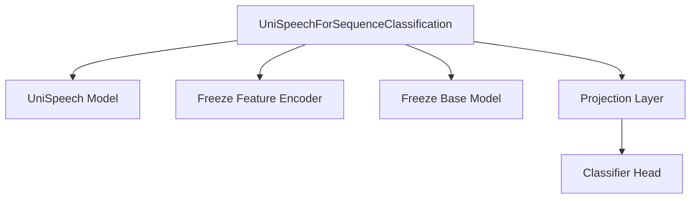

# UniSpeech Sequence Classification Module

The `unispeech_sequence_classification` module provides the necessary components for performing sequence classification tasks using the UniSpeech model architecture. Its primary component, `UniSpeechForSequenceClassification`, extends the base UniSpeech model with a classification head, enabling end-to-end training and inference for tasks such as audio classification.

## Architecture and Component Relationships

The `UniSpeechForSequenceClassification` class integrates a `UniSpeechModel` for feature extraction and adds a customizable classification head on top. It offers methods to selectively freeze parts of the model, which is crucial for fine-tuning scenarios where only the classification head or specific layers need to be updated.

<!-- DIAGRAM_JSON
{
    "direction": "TD",
    "nodes": [
        {"id": "unispeech_for_sequence_classification", "label": "UniSpeechForSequenceClassification", "type": "component", "link": null},
        {"id": "unispeech_model", "label": "UniSpeech Model", "type": "external", "link": "unispeech_models.md"},
        {"id": "feature_encoder_freeze", "label": "Freeze Feature Encoder", "type": "component", "link": null},
        {"id": "base_model_freeze", "label": "Freeze Base Model", "type": "component", "link": null},
        {"id": "projection_layer", "label": "Projection Layer", "type": "component", "link": null},
        {"id": "classifier_head", "label": "Classifier Head", "type": "component", "link": null}
    ],
    "edges": [
        {"source": "unispeech_for_sequence_classification", "target": "unispeech_model"},
        {"source": "unispeech_for_sequence_classification", "target": "feature_encoder_freeze"},
        {"source": "unispeech_for_sequence_classification", "target": "base_model_freeze"},
        {"source": "unispeech_for_sequence_classification", "target": "projection_layer"},
        {"source": "projection_layer", "target": "classifier_head"}
    ],
    "groups": []
}
-->

### `UniSpeechForSequenceClassification` Class

This is the main class within the module, designed for sequence classification. It encapsulates the core UniSpeech model and extends it with specific layers for classification.

-   **Purpose**: To classify input audio sequences into a predefined set of categories.
-   **Core Functionality**:
    -   **Initialization**: Instantiates a `UniSpeechModel` (referred to as `self.unispeech`) and adds a `projector` linear layer (to transform the hidden states) and a `classifier` linear layer (for the final classification output). It ensures that adapters are not used as they are not supported for sequence classification.
    -   **Feature Extraction**: Leverages the `UniSpeechModel` to process raw audio input values and extract rich hidden state representations.
    -   **Pooling and Classification**: After obtaining hidden states from the UniSpeech model, it applies a projection, performs pooling (either mean pooling or weighted sum of layers if `use_weighted_layer_sum` is enabled), and then feeds the pooled output to the `classifier` to produce logits.
    -   **Loss Computation**: If `labels` are provided during the `forward` pass, it computes the Cross-Entropy loss between the predicted logits and the true labels.
    -   **Freezing Mechanisms**: Includes `freeze_feature_encoder()` and `freeze_base_model()` methods. These are vital for transfer learning scenarios, allowing developers to keep the pre-trained feature extractor or the entire base model fixed while training only the new classification head.

### Relationship with other Modules

-   **[UniSpeech Models](unispeech_models.md)**: The `unispeech_sequence_classification` module heavily relies on the core `UniSpeechModel` for its foundational audio feature extraction capabilities. The `UniSpeechForSequenceClassification` class instantiates and utilizes an instance of `UniSpeechModel` to process input audio before applying its specific classification layers.
-   **General Utilities (e.g., PyTorch)**: It uses standard PyTorch components like `torch.nn.Linear` for its projection and classification layers and `torch.nn.CrossEntropyLoss` for calculating the training objective.

## How the Module Fits into the Overall System

This module serves as a specialized application head for the broader UniSpeech model family. It allows the powerful audio representations learned by UniSpeech to be adapted for specific audio classification tasks, such as speaker identification, emotion recognition from speech, or sound event classification. By providing explicit methods for freezing different parts of the model, it facilitates efficient fine-tuning workflows, making it a critical component for leveraging pre-trained UniSpeech models in downstream classification applications. It seamlessly integrates into a larger system requiring audio sequence understanding and categorization, acting as the final stage of a UniSpeech-based audio processing pipeline.