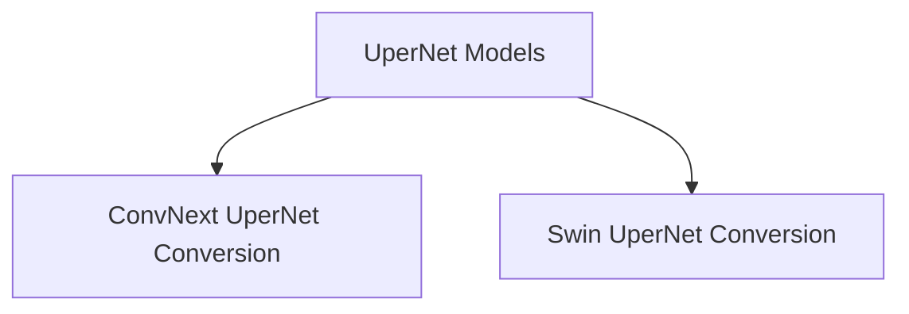

# UperNet Models Documentation

## Introduction

The `upernet_models` module provides utilities for converting UperNet model checkpoints from external repositories, specifically OpenMMLab, into a format compatible with the Hugging Face Transformers library. This facilitates the use of pre-trained UperNet models with various backbones within the Hugging Face ecosystem.

## Architecture Overview

The module is structured around specialized conversion utilities, each designed to handle UperNet models with a particular backbone architecture. The primary components are responsible for loading external checkpoints, renaming keys to match Hugging Face conventions, and verifying the converted model's output.

<!-- DIAGRAM_JSON
{
    "direction": "TD",
    "nodes": [
        {"id": "convnext_conversion", "label": "ConvNext UperNet Conversion", "type": "module", "link": "convnext_conversion.md"},
        {"id": "swin_conversion", "label": "Swin UperNet Conversion", "type": "module", "link": "swin_conversion.md"}
    ],
    "edges": [
        {"source": "upernet_models", "target": "convnext_conversion"},
        {"source": "upernet_models", "target": "swin_conversion"}
    ],
    "groups": []
}
-->

## Sub-modules and Functionality

This module contains the following key sub-modules:

*   ### [ConvNext UperNet Conversion](convnext_conversion.md)
    This sub-module is dedicated to the conversion of UperNet models that utilize a ConvNext backbone. It includes logic for fetching model checkpoints, adapting their weights and configurations to the Hugging Face format, and performing initial verification steps to ensure conversion accuracy.

*   ### [Swin UperNet Conversion](swin_conversion.md)
    This sub-module focuses on the conversion process for UperNet models built upon the Swin Transformer backbone. Similar to its ConvNext counterpart, it handles checkpoint loading, key renaming, and output validation to ensure seamless integration with the Hugging Face Transformers library.
