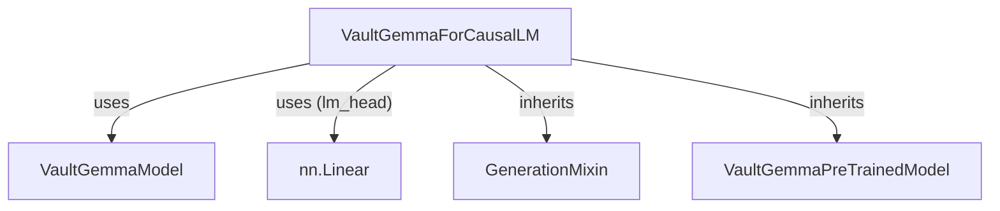

# vaultgemma_causal_lm
This module provides the `VaultGemmaForCausalLM` class, a causal language model built on VaultGemma for text generation tasks.

<!-- DIAGRAM_JSON
{
  "nodes": [
    {"id": "VaultGemmaForCausalLM", "label": "VaultGemmaForCausalLM", "type": "class"},
    {"id": "VaultGemmaModel", "label": "VaultGemmaModel", "type": "class"},
    {"id": "nn.Linear", "label": "nn.Linear", "type": "class"},
    {"id": "GenerationMixin", "label": "GenerationMixin", "type": "class"},
    {"id": "VaultGemmaPreTrainedModel", "label": "VaultGemmaPreTrainedModel", "type": "class"}
  ],
  "edges": [
    {"source": "VaultGemmaForCausalLM", "target": "VaultGemmaModel", "label": "uses"},
    {"source": "VaultGemmaForCausalLM", "target": "nn.Linear", "label": "uses (lm_head)"},
    {"source": "VaultGemmaForCausalLM", "target": "GenerationMixin", "label": "inherits"},
    {"source": "VaultGemmaForCausalLM", "target": "VaultGemmaPreTrainedModel", "label": "inherits"}
  ],
  "groups": []
}
-->
