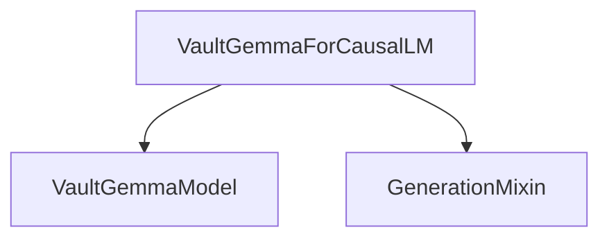

# VaultGemma Models Documentation

## Introduction

The `vaultgemma_models` module provides the core implementation for the VaultGemma causal language model. It focuses on enabling efficient text generation and sequence-to-sequence tasks based on the VaultGemma architecture. This module is essential for applications requiring advanced natural language understanding and generation capabilities using the VaultGemma model.

## Architecture and Component Relationships

This module primarily contains the `VaultGemmaForCausalLM` class, which is responsible for the complete causal language modeling task. It leverages an internal `VaultGemmaModel` for the base model functionalities and integrates with external generation utilities.

<!-- DIAGRAM_JSON
{
    "direction": "TD",
    "nodes": [
        {"id": "vaultgemma_causal_lm", "label": "VaultGemmaForCausalLM", "type": "component", "link": null},
        {"id": "vaultgemma_model", "label": "VaultGemmaModel", "type": "component", "link": null},
        {"id": "generation_mixin", "label": "GenerationMixin", "type": "external", "link": "generation_mixins.md"}
    ],
    "edges": [
        {"source": "vaultgemma_causal_lm", "target": "vaultgemma_model"},
        {"source": "vaultgemma_causal_lm", "target": "generation_mixin"}
    ],
    "groups": []
}
-->



### VaultGemmaForCausalLM

`VaultGemmaForCausalLM` is the primary class within this module, designed for causal language modeling with the VaultGemma architecture. It extends `VaultGemmaPreTrainedModel` and incorporates `GenerationMixin` for text generation capabilities.

**Key Responsibilities:**

- **Model Initialization:** Sets up the core `VaultGemmaModel` and a linear layer (`lm_head`) for predicting vocabulary tokens.
- **Forward Pass:** Processes input IDs, attention masks, and other parameters through the `VaultGemmaModel` to produce hidden states. It then uses the `lm_head` to generate logits.
- **Loss Calculation:** Optionally calculates the causal language modeling loss if `labels` are provided.
- **Logit Softcapping:** Applies a final logit softcapping mechanism if configured, which can help stabilize training and generation.
- **Output:** Returns `CausalLMOutputWithPast`, which includes the computed loss (if any), logits, past key-values for efficient decoding, hidden states, and attentions.

**Code Snippet:**

```python
class VaultGemmaForCausalLM(VaultGemmaPreTrainedModel, GenerationMixin):
    # ... (initializer and forward method as provided in the core components)
```

### VaultGemmaModel

The `VaultGemmaModel` is an internal component leveraged by `VaultGemmaForCausalLM`. It represents the core VaultGemma architecture, handling the transformer layers, embeddings, and other fundamental aspects of the model. While its detailed implementation is outside the scope of this document, it is crucial for generating the hidden states that `VaultGemmaForCausalLM` uses to produce predictions.

### How it Fits into the Overall System

The `vaultgemma_models` module, specifically `VaultGemmaForCausalLM`, serves as the primary interface for users to interact with a pre-trained VaultGemma model for causal language modeling tasks. It relies on the `generation_mixins` module (see [generation_mixins](generation_mixins.md)) to provide functionalities like `generate()`, which simplifies the process of generating text sequences.

This module acts as a concrete implementation of the VaultGemma architecture, making it ready for direct use in applications such as text completion, conversational AI, and other generative tasks. Its integration with `GenerationMixin` highlights its role in the broader ecosystem of Hugging Face Transformers, providing a consistent API for text generation across various models.