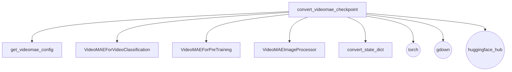

# VideoMAE Models Documentation

This module provides functionalities for converting and verifying VideoMAE model checkpoints to the PyTorch format, ensuring their readiness for use within the Hugging Face Transformers ecosystem. It supports various pre-trained and fine-tuned VideoMAE models for tasks like video classification and masked autoencoding.

## Architecture and Component Relationships

The `videomae_models` module is centered around the `convert_videomae_checkpoint` function, which orchestrates the entire conversion and verification process. It interacts with several internal helper functions and classes to achieve its goal, and also relies on external libraries for specific tasks.

<!-- DIAGRAM_JSON
{
    "direction": "TD",
    "nodes": [
        {"id": "convert_checkpoint", "label": "convert_videomae_checkpoint", "type": "component", "link": null},
        {"id": "get_config", "label": "get_videomae_config", "type": "component", "link": null},
        {"id": "model_video_classification", "label": "VideoMAEForVideoClassification", "type": "component", "link": null},
        {"id": "model_pretraining", "label": "VideoMAEForPreTraining", "type": "component", "link": null},
        {"id": "image_processor", "label": "VideoMAEImageProcessor", "type": "component", "link": null},
        {"id": "convert_state_dict", "label": "convert_state_dict", "type": "component", "link": null},
        {"id": "torch", "label": "torch", "type": "external", "link": null},
        {"id": "gdown", "label": "gdown", "type": "external", "link": null},
        {"id": "huggingface_hub", "label": "huggingface_hub", "type": "external", "link": null}
    ],
    "edges": [
        {"source": "convert_checkpoint", "target": "get_config"},
        {"source": "convert_checkpoint", "target": "model_video_classification"},
        {"source": "convert_checkpoint", "target": "model_pretraining"},
        {"source": "convert_checkpoint", "target": "image_processor"},
        {"source": "convert_checkpoint", "target": "convert_state_dict"},
        {"source": "convert_checkpoint", "target": "torch"},
        {"source": "convert_checkpoint", "target": "gdown"},
        {"source": "convert_checkpoint", "target": "huggingface_hub"}
    ],
    "groups": []
}
-->

### `convert_videomae_checkpoint`

This is the primary function within the `videomae_models` module. Its core responsibility is to:

1.  **Load Configuration**: Retrieves the appropriate VideoMAE model configuration using `get_videomae_config` based on the provided model name.
2.  **Instantiate Model**: Initializes either `VideoMAEForVideoClassification` (for fine-tuned models) or `VideoMAEForPreTraining` (for pre-training models) with the loaded configuration.
3.  **Download Checkpoint**: Downloads the original pre-trained model checkpoint from a specified URL (often Google Drive) using `gdown`.
4.  **Convert State Dictionary**: Transforms the downloaded checkpoint's state dictionary into a format compatible with the Hugging Face model architecture using `convert_state_dict`.
5.  **Load Weights**: Loads the converted state dictionary into the instantiated PyTorch model.
6.  **Verification**: Performs a verification step by processing a sample video using `VideoMAEImageProcessor` and checking the shape and values of the model's output logits against expected values. For pre-training models, it also verifies the loss.
7.  **Save and Push (Optional)**: If specified, saves the converted model and image processor to a local folder and optionally pushes them to the Hugging Face Hub.

### Internal Helpers

*   **`get_videomae_config`**: A utility function responsible for loading the correct configuration for the VideoMAE model based on its name.
*   **`VideoMAEForVideoClassification`**: The PyTorch model class for VideoMAE when used for video classification tasks.
*   **`VideoMAEForPreTraining`**: The PyTorch model class for VideoMAE when used for pre-training tasks (e.g., masked autoencoding).
*   **`VideoMAEImageProcessor`**: Handles the preprocessing of video frames, including resizing, normalization, and converting them into a format suitable for the VideoMAE model.
*   **`convert_state_dict`**: A crucial utility that adapts the keys and potentially the structure of the original model's state dictionary to match the Hugging Face implementation.

### External Dependencies

*   **`torch`**: The primary deep learning framework used for model definition, tensor operations, and loading/saving model states.
*   **`gdown`**: Used for downloading model checkpoints from Google Drive URLs.
*   **`huggingface_hub`**: Utilized for downloading auxiliary files (like `bool_masked_pos.pt`) and for optionally pushing the converted model to the Hugging Face Model Hub.

## How the Module Fits into the Overall System

The `videomae_models` module serves as a critical bridge for integrating VideoMAE models into the Hugging Face ecosystem. It enables developers to seamlessly convert checkpoints from their original sources into a standardized PyTorch format, making them compatible with Hugging Face's utilities for training, inference, and sharing. This module ensures that VideoMAE models can leverage the extensive features provided by the `transformers` library, such as easy loading, fine-tuning, and deployment. It acts as a foundational component for making VideoMAE models accessible and usable by a wider community.
