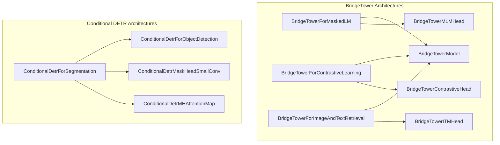

# vision_model_architectures
This module defines various vision-language model architectures, including BridgeTower models for masked language modeling, contrastive learning, and image-text retrieval, as well as a Conditional DETR model for segmentation.

<!-- DIAGRAM_JSON
{
  "nodes": [
    {"id": "BMLM", "label": "BridgeTowerForMaskedLM"},
    {"id": "BCLC", "label": "BridgeTowerForContrastiveLearning"},
    {"id": "BITR", "label": "BridgeTowerForImageAndTextRetrieval"},
    {"id": "CDFS", "label": "ConditionalDetrForSegmentation"},
    {"id": "BTM", "label": "BridgeTowerModel"},
    {"id": "BMLMH", "label": "BridgeTowerMLMHead"},
    {"id": "BCCH", "label": "BridgeTowerContrastiveHead"},
    {"id": "BITMH", "label": "BridgeTowerITMHead"},
    {"id": "CDOD", "label": "ConditionalDetrForObjectDetection"},
    {"id": "CDMHSC", "label": "ConditionalDetrMaskHeadSmallConv"},
    {"id": "CDMHAM", "label": "ConditionalDetrMHAttentionMap"}
  ],
  "edges": [
    {"source": "BMLM", "target": "BTM", "label": "uses"},
    {"source": "BMLM", "target": "BMLMH", "label": "uses"},
    {"source": "BCLC", "target": "BTM", "label": "uses"},
    {"source": "BCLC", "target": "BCCH", "label": "uses"},
    {"source": "BITR", "target": "BTM", "label": "uses"},
    {"source": "BITR", "target": "BITMH", "label": "uses"},
    {"source": "CDFS", "target": "CDOD", "label": "uses"},
    {"source": "CDFS", "target": "CDMHSC", "label": "uses"},
    {"source": "CDFS", "target": "CDMHAM", "label": "uses"}
  ],
  "groups": [
    {"id": "bridgetower_group", "label": "BridgeTower Architectures", "nodes": ["BMLM", "BCLC", "BITR", "BTM", "BMLMH", "BCCH", "BITMH"]},
    {"id": "conditional_detr_group", "label": "Conditional DETR Architectures", "nodes": ["CDFS", "CDOD", "CDMHSC", "CDMHAM"]}
  ]
}
-->
