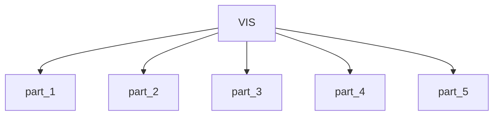

# Vision Model Converters

This module contains 5 sub-modules:

- [part_1](part_1.md) - 21 components
- [part_2](part_2.md) - 23 components
- [part_3](part_3.md) - 18 components
- [part_4](part_4.md) - 20 components
- [part_5](part_5.md) - 11 components

## Architecture

