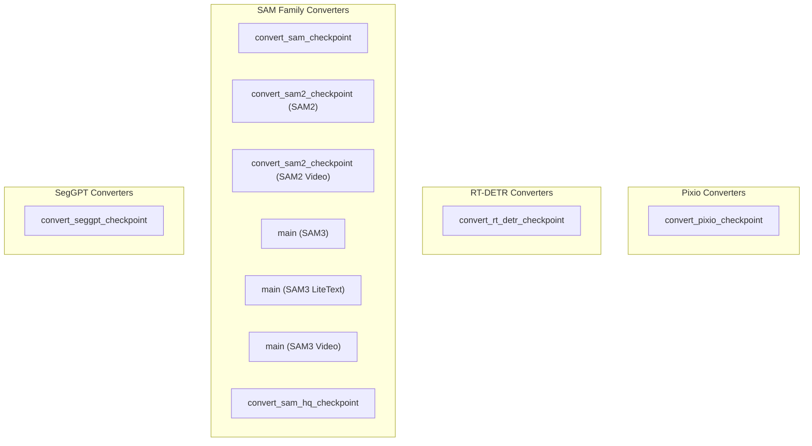

# vision_model_converters_part_4
This module provides scripts for converting various vision model checkpoints, including Pixio, RT-DETR, SAM, SAM2, SAM3, SAM-HQ, and SegGPT, into the Hugging Face Transformers format. It facilitates the integration of these models into the HF ecosystem.

<!-- DIAGRAM_JSON
{
  "nodes": [
    {"id": "Pixio_Convert", "label": "convert_pixio_checkpoint"},
    {"id": "RTDetr_Convert", "label": "convert_rt_detr_checkpoint"},
    {"id": "SAM_Convert", "label": "convert_sam_checkpoint"},
    {"id": "SAM2_Convert", "label": "convert_sam2_checkpoint (SAM2)"},
    {"id": "SAM2Video_Convert", "label": "convert_sam2_checkpoint (SAM2 Video)"},
    {"id": "SAM3_Main", "label": "main (SAM3)"},
    {"id": "SAM3LiteText_Main", "label": "main (SAM3 LiteText)"},
    {"id": "SAM3Video_Main", "label": "main (SAM3 Video)"},
    {"id": "SAMHQ_Convert", "label": "convert_sam_hq_checkpoint"},
    {"id": "SegGPT_Convert", "label": "convert_seggpt_checkpoint"}
  ],
  "edges": [],
  "groups": [
    {"id": "Pixio", "label": "Pixio Converters", "nodes": ["Pixio_Convert"]},
    {"id": "RTDetr", "label": "RT-DETR Converters", "nodes": ["RTDetr_Convert"]},
    {"id": "SAM_Family", "label": "SAM Family Converters", "nodes": ["SAM_Convert", "SAM2_Convert", "SAM2Video_Convert", "SAM3_Main", "SAM3LiteText_Main", "SAM3Video_Main", "SAMHQ_Convert"]},
    {"id": "SegGPT", "label": "SegGPT Converters", "nodes": ["SegGPT_Convert"]}
  ]
}
-->
