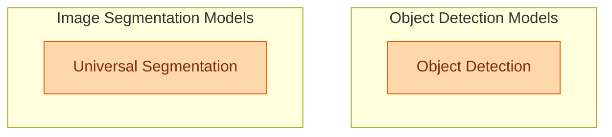

# Vision Models Part 4

This module encompasses models for object detection with language grounding (MMGroundingDino) and universal image segmentation (OneFormer), enabling tasks like semantic, instance, and panoptic segmentation.

<!-- DIAGRAM_JSON
{
    "direction": "TD",
    "nodes": [
        {"id": "object_detection", "label": "Object Detection", "type": "module", "link": "object_detection.md"},
        {"id": "universal_segmentation", "label": "Universal Segmentation", "type": "module", "link": "universal_segmentation.md"}
    ],
    "edges": [],
    "groups": [
        {"id": "detection", "label": "Object Detection Models", "role": "generative", "nodes": ["object_detection"]},
        {"id": "segmentation", "label": "Image Segmentation Models", "role": "generative", "nodes": ["universal_segmentation"]}
    ]
}
-->
