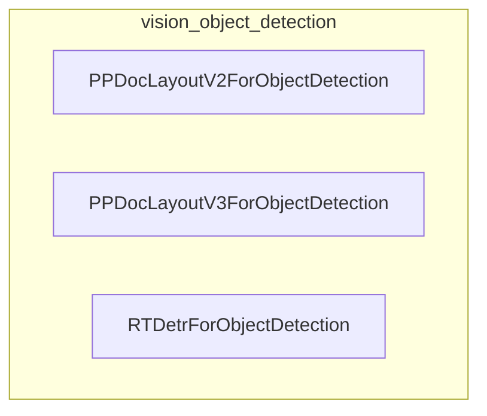

# vision_object_detection
This module provides various object detection models, including PPDocLayoutV2, PPDocLayoutV3, and RTDetr, designed for tasks such as document layout analysis and general object detection.

<!-- DIAGRAM_JSON
{
  "nodes": [
    {"id": "PPDocLayoutV2ForObjectDetection", "label": "PPDocLayoutV2ForObjectDetection"},
    {"id": "PPDocLayoutV3ForObjectDetection", "label": "PPDocLayoutV3ForObjectDetection"},
    {"id": "RTDetrForObjectDetection", "label": "RTDetrForObjectDetection"}
  ],
  "edges": [],
  "groups": [
    {"id": "vision_object_detection", "label": "vision_object_detection", "nodes": ["PPDocLayoutV2ForObjectDetection", "PPDocLayoutV3ForObjectDetection", "RTDetrForObjectDetection"]}
  ]
}
-->
