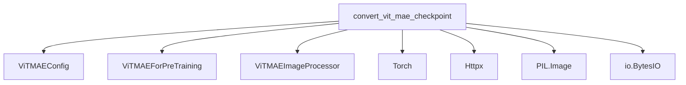

The `vit_mae_models` module focuses on utilities for the Vision Transformer Masked Autoencoder (ViT-MAE) models. Its primary function is to facilitate the conversion of pre-trained ViT-MAE checkpoints into a format compatible with Hugging Face's PyTorch models, enabling seamless integration and usage within the ecosystem. The module also includes basic verification steps to ensure the correctness of the converted model.

### Module Purpose and Core Functionality

The `vit_mae_models` module provides a crucial tool for developers and researchers working with ViT-MAE. Specifically, the `convert_vit_mae_checkpoint` function handles the entire process of downloading a checkpoint from a given URL, configuring the appropriate `ViTMAEConfig` based on the model size (e.g., "large", "huge"), initializing a `ViTMAEForPreTraining` model, and then loading the converted state dictionary. It also performs a forward pass with a sample image and verifies the output logits against expected values, ensuring the conversion was successful. Finally, it saves the converted model and its associated image processor.

### Architecture and Component Relationships

The `vit_mae_models` module, being a leaf module, contains a single core component `convert_vit_mae_checkpoint`. This function orchestrates the interaction with various external libraries and internal helper components to perform the checkpoint conversion and verification.

<!-- DIAGRAM_JSON
{
    "direction": "TD",
    "nodes": [
        {"id": "convert_vit_mae_checkpoint", "label": "convert_vit_mae_checkpoint", "type": "component", "link": null},
        {"id": "vit_mae_config", "label": "ViTMAEConfig", "type": "external", "link": "vit_mae_config.md"},
        {"id": "vit_mae_for_pretraining", "label": "ViTMAEForPreTraining", "type": "external", "link": "modeling_vit_mae.md"},
        {"id": "vit_mae_image_processor", "label": "ViTMAEImageProcessor", "type": "external", "link": "vit_mae_image_processor.md"},
        {"id": "torch", "label": "Torch", "type": "external", "link": null},
        {"id": "httpx", "label": "Httpx", "type": "external", "link": null},
        {"id": "pil_image", "label": "PIL.Image", "type": "external", "link": null},
        {"id": "io_bytesio", "label": "io.BytesIO", "type": "external", "link": null}
    ],
    "edges": [
        {"source": "convert_vit_mae_checkpoint", "target": "vit_mae_config"},
        {"source": "convert_vit_mae_checkpoint", "target": "vit_mae_for_pretraining"},
        {"source": "convert_vit_mae_checkpoint", "target": "vit_mae_image_processor"},
        {"source": "convert_vit_mae_checkpoint", "target": "torch"},
        {"source": "convert_vit_mae_checkpoint", "target": "httpx"},
        {"source": "convert_vit_mae_checkpoint", "target": "pil_image"},
        {"source": "convert_vit_mae_checkpoint", "target": "io_bytesio"}
    ],
    "groups": []
}
-->

### How the Module Fits into the Overall System

The `vit_mae_models` module serves as an integration point for pre-trained ViT-MAE models within a larger machine learning or natural language processing ecosystem. By providing a standardized conversion utility, it allows models trained externally to be easily loaded, fine-tuned, and deployed using the same framework and tools as other models in the system. It abstracts away the complexities of checkpoint format differences and ensures compatibility, making ViT-MAE models readily accessible for various downstream tasks. The module depends on fundamental components like `ViTMAEConfig` for model configuration, `ViTMAEForPreTraining` for the model architecture, and `ViTMAEImageProcessor` for handling image inputs, which are expected to be defined in their respective modules (e.g., [vit_mae_config.md](vit_mae_config.md), [modeling_vit_mae.md](modeling_vit_mae.md), [vit_mae_image_processor.md](vit_mae_image_processor.md)).