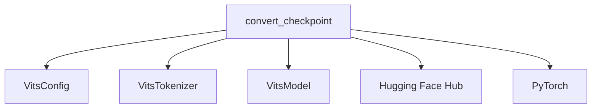

# `vits_models` Module Documentation

The `vits_models` module is responsible for handling the VITS (Variational Inference with Adversarial Learning for End-to-End Text-to-Speech) model within the transformers library. Its primary function is to facilitate the conversion of original VITS checkpoints into a format compatible with Hugging Face Transformers, enabling seamless integration and utilization of VITS models for text-to-speech tasks.

### Architecture and Component Relationships

The core functionality of the `vits_models` module is encapsulated within the `convert_checkpoint` function. This function orchestrates the process of loading original VITS model weights and configurations, adapting them to the Hugging Face `VitsConfig`, `VitsTokenizer`, and `VitsModel` structures, and finally saving the converted model and tokenizer. It also handles the downloading of pre-trained checkpoints and vocabularies from the Hugging Face Hub for specific languages.

<!-- DIAGRAM_JSON
{
    "direction": "TD",
    "nodes": [
        {"id": "convert_checkpoint", "label": "convert_checkpoint", "type": "component", "link": null},
        {"id": "vits_config", "label": "VitsConfig", "type": "component", "link": null},
        {"id": "vits_tokenizer", "label": "VitsTokenizer", "type": "component", "link": null},
        {"id": "vits_model", "label": "VitsModel", "type": "component", "link": null},
        {"id": "huggingface_hub", "label": "Hugging Face Hub", "type": "external", "link": null},
        {"id": "pytorch", "label": "PyTorch", "type": "external", "link": null}
    ],
    "edges": [
        {"source": "convert_checkpoint", "target": "vits_config"},
        {"source": "convert_checkpoint", "target": "vits_tokenizer"},
        {"source": "convert_checkpoint", "target": "vits_model"},
        {"source": "convert_checkpoint", "target": "huggingface_hub"},
        {"source": "convert_checkpoint", "target": "pytorch"}
    ],
    "groups": []
}
-->

### Module Components

#### `convert_checkpoint`

- **Description:** This function is the primary entry point for converting VITS checkpoints. It takes various parameters to specify the output path, original checkpoint location, configuration, vocabulary, and optional model settings like the number of speakers and sampling rate. It intelligently handles both local checkpoint paths and downloading models from the Hugging Face Hub (specifically `facebook/mms-tts`).

- **Core Functionality:**
    - Loads or initializes `VitsConfig` and updates it based on provided parameters (`num_speakers`, `sampling_rate`).
    - Manages the downloading of model files (`vocab.txt`, `config.json`, `.pth` checkpoint) from the Hugging Face Hub for `facebook/mms-tts` models.
    - Determines if `uroman` processing is required based on the original configuration.
    - Constructs the vocabulary and creates a `VitsTokenizer` instance, handling both cases where a `vocab_path` is provided or a default set of symbols (including IPA) is used.
    - Initializes a `VitsModel` with the prepared configuration.
    - Applies and removes weight normalization to the model's decoder during the weight loading process, as per the original VITS implementation details.
    - Recursively loads weights from the original PyTorch checkpoint into the `VitsModel`.
    - Saves the converted `VitsModel` and `VitsTokenizer` to the specified output folder.
    - Offers an option to push the converted model and tokenizer directly to the Hugging Face Hub.

- **Dependencies:**
    - **Internal:** `VitsConfig`, `VitsTokenizer`, `VitsModel` (these are assumed to be defined within the `vits_models` or closely related modules, forming the core Transformers components for VITS).
    - **External:**
        - `torch`: For loading checkpoints and model operations.
        - `huggingface_hub`: For downloading model files and pushing to the hub.
        - `json`, `tempfile`: Python standard library modules for data handling.

### How the Module Fits into the Overall System

The `vits_models` module serves as a critical bridge for integrating VITS models into the Hugging Face ecosystem. By providing a robust conversion utility, it allows users to leverage pre-trained VITS models (especially those from `facebook/mms-tts`) with the convenience and extensive functionalities offered by the Hugging Face Transformers library. This module is essential for applications requiring high-quality, end-to-end text-to-speech generation and contributes to the overall versatility of the model hub by expanding its range of supported audio generation models. It enables downstream tasks such as fine-tuning, inference, and deployment of VITS models within a standardized framework.