# Module: wav2vec2_conversion_utilities

## 1. Introduction
This module provides utilities for converting Wav2Vec2 model checkpoints from their original Fairseq format to the Hugging Face Transformers format. It supports pre-trained, fine-tuned (for CTC), and sequence classification Wav2Vec2 models.

## 2. Architecture and Component Relationships

<!-- DIAGRAM_JSON
{
    "direction": "TD",
    "nodes": [
        {"id": "convert_wav2vec2_checkpoint", "label": "convert_wav2vec2_checkpoint", "type": "component", "link": null},
        {"id": "wav2vec2_config", "label": "Wav2Vec2Config", "type": "external", "link": "wav2vec2_models.md"},
        {"id": "wav2vec2_feature_extractor", "label": "Wav2Vec2FeatureExtractor", "type": "external", "link": "wav2vec2_models.md"},
        {"id": "wav2vec2_tokenizer", "label": "Wav2Vec2CTCTokenizer", "type": "external", "link": "wav2vec2_models.md"},
        {"id": "wav2vec2_processor", "label": "Wav2Vec2Processor", "type": "external", "link": "wav2vec2_models.md"},
        {"id": "wav2vec2_for_ctc", "label": "Wav2Vec2ForCTC", "type": "external", "link": "wav2vec2_models.md"},
        {"id": "wav2vec2_for_seq_class", "label": "Wav2Vec2ForSequenceClassification", "type": "external", "link": "wav2vec2_models.md"},
        {"id": "wav2vec2_for_pretraining", "label": "Wav2Vec2ForPreTraining", "type": "external", "link": "wav2vec2_models.md"},
        {"id": "fairseq_library", "label": "Fairseq Library", "type": "external", "link": null}
    ],
    "edges": [
        {"source": "convert_wav2vec2_checkpoint", "target": "wav2vec2_config"},
        {"source": "convert_wav2vec2_checkpoint", "target": "wav2vec2_feature_extractor"},
        {"source": "convert_wav2vec2_checkpoint", "target": "wav2vec2_tokenizer"},
        {"source": "convert_wav2vec2_checkpoint", "target": "wav2vec2_processor"},
        {"source": "convert_wav2vec2_checkpoint", "target": "wav2vec2_for_ctc"},
        {"source": "convert_wav2vec2_checkpoint", "target": "wav2vec2_for_seq_class"},
        {"source": "convert_wav2vec2_checkpoint", "target": "wav2vec2_for_pretraining"},
        {"source": "convert_wav2vec2_checkpoint", "target": "fairseq_library"}
    ],
    "groups": []
}
-->

```mermaid
graph TD
    convert_wav2vec2_checkpoint[convert_wav2vec2_checkpoint]
    wav2vec2_config[Wav2Vec2Config]
    wav2vec2_feature_extractor[Wav2Vec2FeatureExtractor]
    wav2vec2_tokenizer[Wav2Vec2CTCTokenizer]
    wav2vec2_processor[Wav2Vec2Processor]
    wav2vec2_for_ctc[Wav2Vec2ForCTC]
    wav2vec2_for_seq_class[Wav2Vec2ForSequenceClassification]
    wav2vec2_for_pretraining[Wav2Vec2ForPreTraining]
    fairseq_library[Fairseq Library]

    convert_wav2vec2_checkpoint --> wav2vec2_config
    convert_wav2vec2_checkpoint --> wav2vec2_feature_extractor
    convert_wav2vec2_checkpoint --> wav2vec2_tokenizer
    convert_wav2vec2_checkpoint --> wav2vec2_processor
    convert_wav2vec2_checkpoint --> wav2vec2_for_ctc
    convert_wav2vec2_checkpoint --> wav2vec2_for_seq_class
    convert_wav2vec2_checkpoint --> wav2vec2_for_pretraining
    convert_wav2vec2_checkpoint --> fairseq_library
```

## 3. Core Functionality

The main component of this module is `convert_wav2vec2_checkpoint`.

### `convert_wav2vec2_checkpoint`
*   **Purpose**: This function is responsible for orchestrating the conversion of an original Fairseq Wav2Vec2 model checkpoint to a Hugging Face Transformers compatible model. It handles the loading of the Fairseq model, configuration adjustments, tokenizer/feature extractor setup, and weight transfer.
*   **Parameters**:
    *   `checkpoint_path` (str): Path to the original Fairseq model checkpoint.
    *   `pytorch_dump_folder_path` (str): Directory where the converted Hugging Face model and associated files will be saved.
    *   `config_path` (str, optional): Path to a custom configuration file for the Hugging Face model. If not provided, a default `Wav2Vec2Config` is used.
    *   `dict_path` (str, optional): Path to the dictionary file (`dict.ltr.txt` for CTC or labels for sequence classification) used by the Fairseq model. Essential for fine-tuned and sequence classification models.
    *   `is_finetuned` (bool): A flag indicating if the original checkpoint is a fine-tuned model (e.g., for CTC). Defaults to `True`.
    *   `is_seq_class` (bool): A flag indicating if the original checkpoint is a sequence classification model. Defaults to `False`.
*   **Process**:
    1.  **Configuration Loading**: It first loads the `Wav2Vec2Config` using `config_path` or a default configuration.
    2.  **Model Type Determination**:
        *   If `is_seq_class` is `True`, it initializes a [Wav2Vec2ForSequenceClassification](wav2vec2_models.md) model and a [Wav2Vec2FeatureExtractor](wav2vec2_models.md). It also reads labels from `dict_path` to set `config.id2label`.
        *   If `is_finetuned` is `True` (and `is_seq_class` is `False`), it loads the Fairseq `Dictionary` to configure the tokenizer. It adjusts `bos_token_id`, `pad_token_id`, `eos_token_id`, and `vocab_size` in the `Wav2Vec2Config`. A `vocab.json` file is created, and a [Wav2Vec2CTCTokenizer](wav2vec2_models.md), [Wav2Vec2FeatureExtractor](wav2vec2_models.md), and [Wav2Vec2Processor](wav2vec2_models.md) are initialized and saved. Finally, a [Wav2Vec2ForCTC](wav2vec2_models.md) model is initialized.
        *   If neither `is_finetuned` nor `is_seq_class` is `True`, it initializes a [Wav2Vec2ForPreTraining](wav2vec2_models.md) model.
    3.  **Fairseq Model Loading**: The original Fairseq model is loaded using `fairseq.checkpoint_utils.load_model_ensemble_and_task`. This step is critical for accessing the original weights.
    4.  **Weight Transfer**: The `recursively_load_weights` utility (not detailed in the provided snippet but implied) is used to copy the weights from the loaded Fairseq model to the newly initialized Hugging Face model.
    5.  **Model Saving**: The converted Hugging Face model is saved to the `pytorch_dump_folder_path`.
*   **Dependencies**: This function heavily relies on components from the [wav2vec2_models](wav2vec2_models.md) module for its configuration, models, feature extractors, and tokenizers. It also depends on the Fairseq library for loading the original checkpoints.

## 4. How it Fits into the Overall System

This `wav2vec2_conversion_utilities` module is an essential part of the larger system responsible for model interoperability. It enables the seamless integration of pre-trained or fine-tuned Wav2Vec2 models from the Fairseq ecosystem into the Hugging Face Transformers framework. By providing a standardized conversion process, it allows developers to leverage existing Fairseq checkpoints within applications built on Hugging Face, facilitating easier model migration, evaluation, and deployment without requiring re-training. This module ensures that the rich set of Wav2Vec2 models developed using Fairseq can be utilized and extended within the Hugging Face ecosystem.
