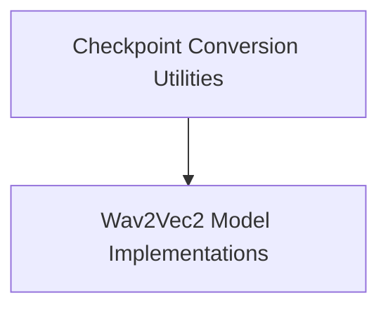

# wav2vec2_models Module Documentation

## Introduction

The `wav2vec2_models` module provides implementations and utilities for working with Wav2Vec2 models, a powerful framework for self-supervised learning of speech representations. This module includes functionalities for converting original PyTorch checkpoints and specialized model architectures for tasks like X-Vector extraction and audio frame classification.

## Architecture Overview

The `wav2vec2_models` module is structured into key sub-modules that handle distinct aspects of Wav2Vec2 model management and application. The architecture separates utility functions for model conversion from the core model implementations for various downstream tasks.

<!-- DIAGRAM_JSON
{
    "direction": "TD",
    "nodes": [
        {"id": "conversion_utilities", "label": "Checkpoint Conversion Utilities", "type": "module", "link": "conversion_utilities.md"},
        {"id": "modeling_implementations", "label": "Wav2Vec2 Model Implementations", "type": "module", "link": "modeling_implementations.md"}
    ],
    "edges": [
        {"source": "conversion_utilities", "target": "modeling_implementations"}
    ],
    "groups": []
}
-->

## Sub-modules

### [Checkpoint Conversion Utilities](conversion_utilities.md)
This sub-module focuses on the essential task of converting original fairseq Wav2Vec2 PyTorch checkpoints into a format compatible with the Hugging Face Transformers library. It ensures seamless integration and usability of pre-trained models within the ecosystem.

### [Wav2Vec2 Model Implementations](modeling_implementations.md)
This sub-module provides specific implementations of Wav2Vec2 models tailored for various downstream tasks. It includes architectures such as `Wav2Vec2ForXVector` for speaker verification and `Wav2Vec2ForAudioFrameClassification` for classifying individual audio frames.
