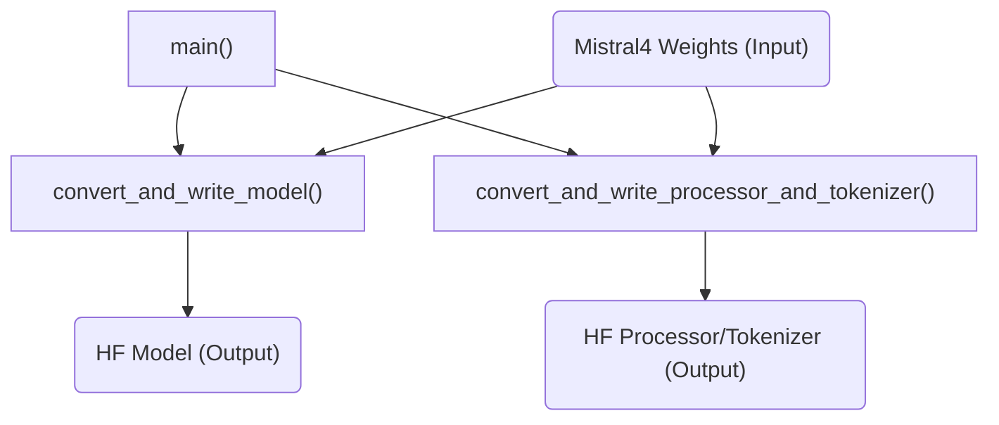

# `weight_conversion` Module Documentation

## Introduction

The `weight_conversion` module is a critical utility within the `mistral4_models` package, responsible for converting original Mistral4 model weights and their associated processor and tokenizer into the HuggingFace (HF) format. This conversion facilitates seamless integration and usage of Mistral4 models within the HuggingFace ecosystem, supporting various output formats like FP8 quantization or BF16 descaling.

## Architecture and Core Components

The `weight_conversion` module primarily revolves around a `main` function that orchestrates the entire conversion process. It takes the path to the original Mistral4 weights and an output directory for the HuggingFace formatted model. The process involves two main steps: converting the model weights and then converting the processor and tokenizer.

### Core Components

*   `src.transformers.models.mistral4.convert_mistral4_weight_to_hf.main`:
    This is the entry point for the weight conversion process. It parses command-line arguments such as input and output directories, maximum position embeddings, and the desired output format (FP8 or BF16). It then calls internal functions to handle the model and processor/tokenizer conversions.

    **Arguments:**
    *   `input_dir` (Path): Directory containing the original Mistral4 weights (e.g., `params.json`, `tekken.json`, `*.safetensors`).
    *   `output_dir` (Path): The directory where the converted HuggingFace model and tokenizer will be saved.
    *   `--max_position_embeddings` (int, default: 1_048_576): Specifies the maximum position embeddings to use if not defined in `params.json`.
    *   `--output_format` (str, choices: ["fp8", "bf16"], default: "fp8"): Determines the output weight format. "fp8" maintains FP8 quantization, while "bf16" descales weights to BF16.

### Module Relationships

The `weight_conversion` module is a sub-module of `mistral4_models`. It depends on the structure of the original Mistral4 weights and produces outputs compatible with the HuggingFace `transformers` library. While specific dependencies on other internal `mistral4_models` components are not explicitly shown in the provided snippet, it is implied that `convert_and_write_model` and `convert_and_write_processor_and_tokenizer` (internal functions called by `main`) interact with utilities for loading and saving model configurations and tokenizers.

<!-- DIAGRAM_JSON
{
    "direction": "TD",
    "nodes": [
        {"id": "main", "label": "main()", "type": "component", "link": null},
        {"id": "convert_model", "label": "convert_and_write_model()", "type": "component", "link": null},
        {"id": "convert_processor_tokenizer", "label": "convert_and_write_processor_and_tokenizer()", "type": "component", "link": null},
        {"id": "mistral4_weights_input", "label": "Mistral4 Weights (Input)", "type": "external", "link": null},
        {"id": "hf_model_output", "label": "HF Model (Output)", "type": "external", "link": null},
        {"id": "hf_processor_tokenizer_output", "label": "HF Processor/Tokenizer (Output)", "type": "external", "link": null}
    ],
    "edges": [
        {"source": "main", "target": "convert_model"},
        {"source": "main", "target": "convert_processor_tokenizer"},
        {"source": "mistral4_weights_input", "target": "convert_model"},
        {"source": "mistral4_weights_input", "target": "convert_processor_tokenizer"},
        {"source": "convert_model", "target": "hf_model_output"},
        {"source": "convert_processor_tokenizer", "target": "hf_processor_tokenizer_output"}
    ],
    "groups": []
}
-->

## How it Fits into the Overall System

The `weight_conversion` module is essential for enabling the use of Mistral4 models within the broader HuggingFace ecosystem. By converting the native Mistral4 model format into the standardized HuggingFace format, it allows developers to leverage the extensive tooling, utilities, and integrations provided by HuggingFace for tasks such as fine-tuning, inference, and deployment. This module acts as a bridge, making Mistral4 models accessible and interoperable with other HuggingFace-compatible models and libraries. It specifically serves the `mistral4_models` module by providing the necessary conversion capabilities.