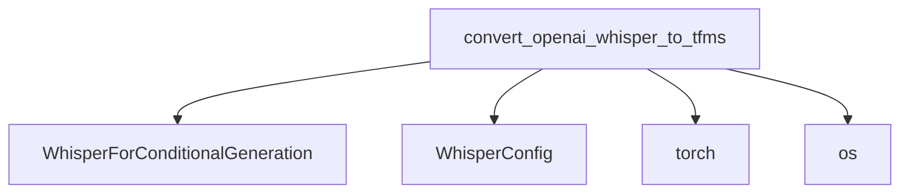

# Whisper Models Documentation

The `whisper_models` module is primarily responsible for facilitating the conversion of OpenAI's Whisper model checkpoints into a format compatible with the Hugging Face Transformers library. This module is crucial for users who wish to leverage pre-trained Whisper models from OpenAI within the Hugging Face ecosystem, enabling seamless integration with existing Transformers pipelines, utilities, and training features.

## Core Functionality

The main functionality of this module revolves around the `convert_openai_whisper_to_tfms` function. This function takes an OpenAI Whisper model checkpoint (either a local path or a model name to download) and transforms it into a `WhisperForConditionalGeneration` model, configured for use within the Hugging Face Transformers framework.

### `convert_openai_whisper_to_tfms`

```python
def convert_openai_whisper_to_tfms(
    checkpoint_path, pytorch_dump_folder_path
) -> tuple[WhisperForConditionalGeneration, bool, int]:
    if ".pt" not in checkpoint_path:
        root = os.path.dirname(pytorch_dump_folder_path) or "."
        original_checkpoint = _download(_MODELS[checkpoint_path], root)
        openai_version = checkpoint_path
    else:
        original_checkpoint = torch.load(checkpoint_path, map_location="cpu", weights_only=True)
        openai_version = None

    dimensions = original_checkpoint["dims"]
    state_dict = original_checkpoint["model_state_dict"]
    proj_out_weights = state_dict["decoder.token_embedding.weight"]
    remove_ignore_keys_(state_dict)
    rename_keys(state_dict)
    tie_embeds = True
    ffn_dim = state_dict["decoder.layers.0.fc1.weight"].shape[0]

    # a hacky way to properly set up the bos/eos/pad token ids in the model
    endoftext_id = 50257 if dimensions["n_vocab"] > 51865 else 50256

    config = WhisperConfig(
        vocab_size=dimensions["n_vocab"],
        encoder_ffn_dim=ffn_dim,
        decoder_ffn_dim=ffn_dim,
        num_mel_bins=dimensions["n_mels"],
        d_model=dimensions["n_audio_state"],
        max_target_positions=dimensions["n_text_ctx"],
        encoder_layers=dimensions["n_audio_layer"],
        encoder_attention_heads=dimensions["n_audio_head"],
        decoder_layers=dimensions["n_text_layer"],
        decoder_attention_heads=dimensions["n_text_head"],
        max_source_positions=dimensions["n_audio_ctx"],
        eos_token_id=endoftext_id,
        bos_token_id=endoftext_id,
        pad_token_id=endoftext_id,
        decoder_start_token_id=endoftext_id + 1,
    )

    model = WhisperForConditionalGeneration(config)
    missing, unexpected = model.model.load_state_dict(state_dict, strict=False)
    if len(missing) > 0 and not set(missing) <= {
        "encoder.embed_positions.weights",
        "decoder.embed_positions.weights",
    }:
        raise ValueError(
            "Only `encoder.embed_positions.weights` and `decoder.embed_positions.weights`  are allowed to be missing,"
            f" but all the following weights are missing {missing}"
        )

    if tie_embeds:
        model.proj_out = make_linear_from_emb(model.model.decoder.embed_tokens)
    else:
        model.proj_out.weight.data = proj_out_weights

    # determine those parameters from a model checkpoint as Whisper repo does
    is_multilingual = model.config.vocab_size >= 51865
    num_languages = model.config.vocab_size - 51765 - int(is_multilingual)

    model.generation_config = _get_generation_config(
        is_multilingual,
        num_languages,
        openai_version,
    )

    return model, is_multilingual, num_languages
```

This function performs the following key steps:

1.  **Checkpoint Loading**: It loads the OpenAI Whisper model checkpoint, either from a local `.pt` file or by downloading a pre-defined model based on a checkpoint name.
2.  **Dimension Extraction**: Extracts crucial model dimensions (e.g., `n_vocab`, `n_mels`, `n_audio_state`, `n_text_ctx`, etc.) from the loaded checkpoint's metadata.
3.  **State Dictionary Transformation**: The state dictionary keys from the OpenAI checkpoint are renamed and adjusted to align with the naming conventions expected by the Hugging Face `WhisperForConditionalGeneration` model architecture.
4.  **Configuration Generation**: A `WhisperConfig` object is instantiated using the extracted dimensions. This configuration sets up the model's architecture parameters, including vocabulary size, encoder/decoder layer counts, attention heads, and special token IDs (like `bos_token_id`, `eos_token_id`, `pad_token_id`, `decoder_start_token_id`).
5.  **Model Instantiation and State Loading**: A `WhisperForConditionalGeneration` model is created using the generated configuration. The transformed state dictionary is then loaded into this new model.
6.  **Output Projection Layer Handling**: The `proj_out` layer (responsible for projecting decoder hidden states to vocabulary logits) is correctly tied or set using weights from the original checkpoint, ensuring proper vocabulary mapping.
7.  **Multilingual Detection and Generation Config Setup**: The function determines if the model is multilingual based on its vocabulary size and calculates the number of supported languages. It then creates and attaches a `GenerationConfig` to the model, which includes parameters vital for controlling the text generation process, such as language tokens and task tokens.

## Architecture and Component Relationships

The `whisper_models` module acts as an adapter, translating between the OpenAI Whisper implementation and the Hugging Face Transformers standard.

<!-- DIAGRAM_JSON
{
    "direction": "TD",
    "nodes": [
        {"id": "convert_func", "label": "convert_openai_whisper_to_tfms", "type": "component", "link": null},
        {"id": "whisper_for_conditional_generation", "label": "WhisperForConditionalGeneration", "type": "external", "link": "modeling_whisper.md"},
        {"id": "whisper_config", "label": "WhisperConfig", "type": "external", "link": "modeling_whisper.md"},
        {"id": "torch_lib", "label": "torch", "type": "external", "link": null},
        {"id": "os_lib", "label": "os", "type": "external", "link": null}
    ],
    "edges": [
        {"source": "convert_func", "target": "whisper_for_conditional_generation"},
        {"source": "convert_func", "target": "whisper_config"},
        {"source": "convert_func", "target": "torch_lib"},
        {"source": "convert_func", "target": "os_lib"}
    ],
    "groups": []
}
-->


## How the module fits into the overall system

This module is a utility within the broader Hugging Face Transformers library, specifically for the [Whisper model family](modeling_whisper.md). It enables interoperability by providing a clear path to utilize models originally released by OpenAI in a Hugging Face-native environment. This facilitates:

*   **Model Portability**: Users can easily switch between OpenAI's original implementations and Hugging Face's standardized versions.
*   **Ecosystem Integration**: Converted models can benefit from Hugging Face's rich ecosystem of tools, including tokenizers, trainers, and pipeline abstractions.
*   **Further Development**: Researchers and developers can use the converted models as a starting point for fine-tuning, experimentation, and building new applications within the Hugging Face framework.

It acts as a bridge, ensuring that the valuable pre-trained assets from OpenAI's Whisper are readily accessible and usable for a wider community within a well-established ML framework. The core model architecture definitions (`WhisperForConditionalGeneration` and `WhisperConfig`) are expected to reside in a module like `modeling_whisper`.
