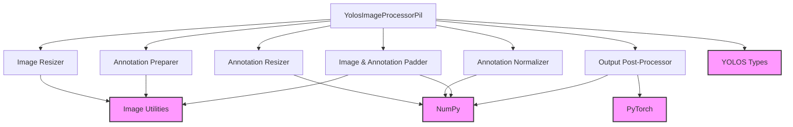

# yolos_models

The `yolos_models` module focuses on providing essential functionalities for the YOLOS (You Only Look One-level Segmentation) object detection models, primarily through its `YolosImageProcessorPil` component. This module facilitates the preparation of images and their corresponding annotations for model input and also handles the post-processing of model outputs to yield final object detection predictions.

### Core Functionality

The `yolos_models` module, through the `YolosImageProcessorPil` class, offers comprehensive image and annotation processing capabilities:

*   **Image Preprocessing**: It handles various transformations required before feeding images to a YOLOS model. This includes:
    *   **Resizing**: Images can be resized based on the shortest edge, longest edge, maximum height/width, or to an exact `(height, width)`.
    *   **Rescaling**: Pixel values are scaled to a desired range.
    *   **Normalization**: Images are normalized using specified mean and standard deviation values.
    *   **Padding**: Images are padded to a uniform size within a batch, and a corresponding pixel mask is generated to distinguish valid pixels from padding.
*   **Annotation Handling**: The module is adept at preparing and transforming COCO-formatted annotations for both detection and panoptic segmentation tasks. It supports:
    *   **Conversion**: Raw COCO annotations are converted into a structured format suitable for the YOLOS model.
    *   **Resizing Annotations**: Bounding boxes and segmentation masks are resized proportionally to the image resizing.
    *   **Normalization of Annotations**: Bounding box coordinates are normalized to a \[0, 1] range and converted to a center-based format.
    *   **Annotation Update during Padding**: Annotations are adjusted to reflect the padding applied to images.
*   **Object Detection Post-processing**: After the YOLOS model generates raw outputs (logits and bounding box predictions), `YolosImageProcessorPil` can convert these into final, interpretable object detection results, including scores, labels, and bounding boxes in a standard `(top_left_x, top_left_y, bottom_right_x, bottom_right_y)` format, with optional resizing to original image dimensions.

### Architecture and Component Relationships

The `yolos_models` module is built around the `YolosImageProcessorPil` class, which encapsulates the entire image and annotation processing pipeline. It interacts with several internal methods and relies on external utilities for various operations.

<!-- DIAGRAM_JSON
{
    "direction": "TD",
    "nodes": [
        {"id": "yolos_image_processor_pil", "label": "YolosImageProcessorPil", "type": "component", "link": null},
        {"id": "image_resizer", "label": "Image Resizer", "type": "component", "link": null},
        {"id": "annotation_preparer", "label": "Annotation Preparer", "type": "component", "link": null},
        {"id": "annotation_resizer", "label": "Annotation Resizer", "type": "component", "link": null},
        {"id": "annotation_normalizer", "label": "Annotation Normalizer", "type": "component", "link": null},
        {"id": "image_and_annotation_padder", "label": "Image & Annotation Padder", "type": "component", "link": null},
        {"id": "output_post_processor", "label": "Output Post-Processor", "type": "component", "link": null},
        {"id": "image_utilities", "label": "Image Utilities", "type": "external", "link": "image_utilities.md"},
        {"id": "numpy_library", "label": "NumPy", "type": "external", "link": null},
        {"id": "pytorch_library", "label": "PyTorch", "type": "external", "link": null},
        {"id": "yolos_types", "label": "YOLOS Types", "type": "external", "link": null}
    ],
    "edges": [
        {"source": "yolos_image_processor_pil", "target": "image_resizer"},
        {"source": "yolos_image_processor_pil", "target": "annotation_preparer"},
        {"source": "yolos_image_processor_pil", "target": "annotation_resizer"},
        {"source": "yolos_image_processor_pil", "target": "annotation_normalizer"},
        {"source": "yolos_image_processor_pil", "target": "image_and_annotation_padder"},
        {"source": "yolos_image_processor_pil", "target": "output_post_processor"},
        {"source": "yolos_image_processor_pil", "target": "image_utilities"},
        {"source": "image_resizer", "target": "image_utilities"},
        {"source": "annotation_preparer", "target": "image_utilities"},
        {"source": "annotation_resizer", "target": "numpy_library"},
        {"source": "annotation_normalizer", "target": "numpy_library"},
        {"source": "image_and_annotation_padder", "target": "numpy_library"},
        {"source": "image_and_annotation_padder", "target": "image_utilities"},
        {"source": "output_post_processor", "target": "pytorch_library"},
        {"source": "output_post_processor", "target": "numpy_library"},
        {"source": "yolos_image_processor_pil", "target": "yolos_types"}
    ],
    "groups": []
}
-->

**Internal Components:**

*   **`YolosImageProcessorPil`**: The central class managing the entire image and annotation processing workflow. It configures and orchestrates all the individual processing steps.
*   **Image Resizer**: Handles the `resize` operation, adjusting image dimensions according to various strategies (e.g., shortest edge, longest edge, exact size).
*   **Annotation Preparer**: Manages the `prepare_annotation` logic, converting raw COCO-style annotations into the model-specific target format.
*   **Annotation Resizer**: Implements `resize_annotation` to scale bounding box coordinates and segmentation masks proportionally with image resizing.
*   **Annotation Normalizer**: Responsible for `normalize_annotation`, transforming bounding box coordinates into a normalized, center-based format.
*   **Image & Annotation Padder**: Executes the `pad` operation, adding padding to images to achieve uniform dimensions and updating corresponding annotations.
*   **Output Post-Processor**: Contains `post_process_object_detection` functionality, converting raw model outputs into final detection results.

**External Dependencies:**

*   **`image_utilities`**: This module (likely located at `src/transformers/image_processing_utils.py`) provides general image processing helper functions such as `get_size_dict`, `get_image_size`, `get_max_height_width`, and potentially functions for preparing COCO annotations like `prepare_coco_detection_annotation` and `prepare_coco_panoptic_annotation`. Refer to [image_utilities.md](image_utilities.md) for more details.
*   **NumPy**: Used extensively for numerical operations on image and annotation arrays.
*   **PyTorch**: Essential for tensor manipulations in the `post_process_object_detection` method, especially for operations like softmax and tensor-based scaling.
*   **YOLOS Types**: Represents various data structures and type hints used within the processor, such as `YolosImageProcessorKwargs`, `AnnotationType`, `SizeDict`, and `YolosObjectDetectionOutput`.

### Integration with the Overall System

The `yolos_models` module, specifically `YolosImageProcessorPil`, is a crucial component within a larger machine learning system, particularly for applications involving the YOLOS object detection architecture. It acts as a bridge between raw input data (images and annotations) and the YOLOS model, ensuring that the data is in the correct format and scale for efficient and accurate inference or training.

Typically, `YolosImageProcessorPil` would be used in the following workflow:

1.  **Data Loading**: Raw images and their corresponding COCO-formatted annotations are loaded.
2.  **Preprocessing**: An instance of `YolosImageProcessorPil` is used to preprocess the images and annotations. This step transforms the raw data into the `pixel_values`, `pixel_mask`, and `labels` (processed annotations) that the YOLOS model expects.
3.  **Model Inference/Training**: The preprocessed data is then fed into a YOLOS model for object detection.
4.  **Post-processing**: The raw outputs from the YOLOS model are passed back to `YolosImageProcessorPil`'s `post_process_object_detection` method to convert them into human-readable bounding box predictions with associated scores and labels.

This module is designed to be highly configurable, allowing developers to customize resizing strategies, normalization parameters, and annotation handling based on the specific YOLOS model variant and dataset requirements. Its integration ensures a standardized and robust data pipeline for YOLOS-based computer vision tasks.
