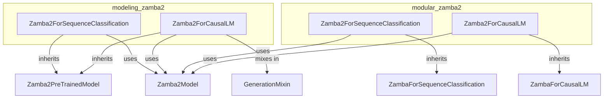

# zamba2_models
The `zamba2_models` module offers Zamba2 model heads for sequence classification and causal language modeling. It includes implementations in `modeling_zamba2` and `modular_zamba2`, all leveraging the core `Zamba2Model`.

<!-- DIAGRAM_JSON
{
  "nodes": [
    {"id": "Z2SC_M", "label": "Zamba2ForSequenceClassification"},
    {"id": "Z2CL_M", "label": "Zamba2ForCausalLM"},
    {"id": "Z2SC_MOD", "label": "Zamba2ForSequenceClassification"},
    {"id": "Z2CL_MOD", "label": "Zamba2ForCausalLM"},
    {"id": "Z2Model", "label": "Zamba2Model"},
    {"id": "Z2PTM", "label": "Zamba2PreTrainedModel"},
    {"id": "GM", "label": "GenerationMixin"},
    {"id": "ZSC", "label": "ZambaForSequenceClassification"},
    {"id": "ZCL", "label": "ZambaForCausalLM"}
  ],
  "edges": [
    {"source": "Z2SC_M", "target": "Z2PTM", "type": "inheritance"},
    {"source": "Z2CL_M", "target": "Z2PTM", "type": "inheritance"},
    {"source": "Z2CL_M", "target": "GM", "type": "inheritance"},
    {"source": "Z2SC_MOD", "target": "ZSC", "type": "inheritance"},
    {"source": "Z2CL_MOD", "target": "ZCL", "type": "inheritance"},
    {"source": "Z2SC_M", "target": "Z2Model", "type": "composition"},
    {"source": "Z2CL_M", "target": "Z2Model", "type": "composition"},
    {"source": "Z2SC_MOD", "target": "Z2Model", "type": "composition"},
    {"source": "Z2CL_MOD", "target": "Z2Model", "type": "composition"}
  ],
  "groups": [
    {"id": "modeling_zamba2", "label": "modeling_zamba2", "nodes": ["Z2SC_M", "Z2CL_M"]},
    {"id": "modular_zamba2", "label": "modular_zamba2", "nodes": ["Z2SC_MOD", "Z2CL_MOD"]}
  ]
}
-->
