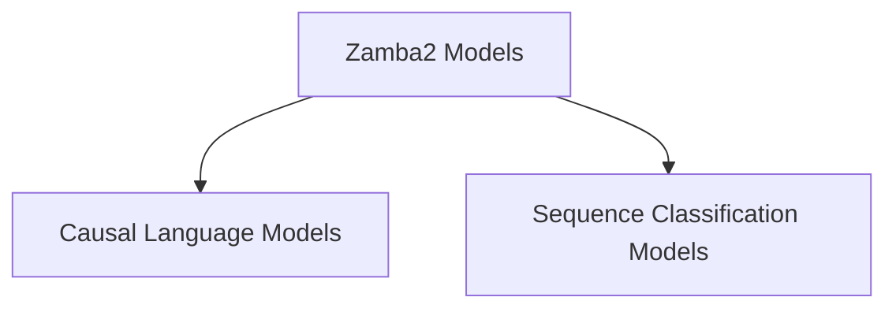

# Zamba2 Models Module Documentation

## Introduction

The `zamba2_models` module provides implementations of the Zamba2 model for various natural language processing tasks, including causal language modeling and sequence classification. It offers both standard and modular architectures to support flexible integration and experimentation.

## Architecture Overview

The `zamba2_models` module is structured into sub-modules based on their primary functionality. This design promotes code reusability and clear separation of concerns, allowing developers to easily understand and extend specific aspects of the Zamba2 model.

<!-- DIAGRAM_JSON
{
    "direction": "TD",
    "nodes": [
        {"id": "causal_lm_models", "label": "Causal Language Models", "type": "module", "link": "causal_lm_models.md"},
        {"id": "sequence_classification_models", "label": "Sequence Classification Models", "type": "module", "link": "sequence_classification_models.md"}
    ],
    "edges": [
        {"source": "zamba2_models", "target": "causal_lm_models"},
        {"source": "zamba2_models", "target": "sequence_classification_models"}
    ],
    "groups": []
}
-->

## Sub-modules

### [Causal Language Models](causal_lm_models.md)
This sub-module provides implementations of the Zamba2 model specifically designed for causal language modeling tasks. It includes components for generating text and handling various aspects of language generation.

### [Sequence Classification Models](sequence_classification_models.md)
This sub-module focuses on Zamba2 model implementations tailored for sequence classification tasks. It contains components that enable the model to classify sequences based on predefined labels.