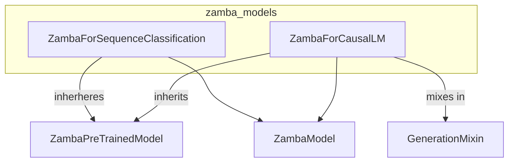

# zamba_models
The `zamba_models` module provides `ZambaForSequenceClassification` for sequence classification tasks and `ZambaForCausalLM` for causal language modeling, both built upon a shared `ZambaModel` backbone.

<!-- DIAGRAM_JSON
{
  "nodes": [
    {
      "id": "ZambaForSequenceClassification",
      "label": "ZambaForSequenceClassification",
      "type": "class"
    },
    {
      "id": "ZambaForCausalLM",
      "label": "ZambaForCausalLM",
      "type": "class"
    },
    {
      "id": "ZambaPreTrainedModel",
      "label": "ZambaPreTrainedModel",
      "type": "class"
    },
    {
      "id": "GenerationMixin",
      "label": "GenerationMixin",
      "type": "class"
    },
    {
      "id": "ZambaModel",
      "label": "ZambaModel",
      "type": "class"
    }
  ],
  "edges": [
    {
      "source": "ZambaForSequenceClassification",
      "target": "ZambaPreTrainedModel",
      "label": "inherits",
      "type": "inheritance"
    },
    {
      "source": "ZambaForCausalLM",
      "target": "ZambaPreTrainedModel",
      "label": "inherits",
      "type": "inheritance"
    },
    {
      "source": "ZambaForCausalLM",
      "target": "GenerationMixin",
      "label": "inherits",
      "type": "inheritance"
    },
    {
      "source": "ZambaForSequenceClassification",
      "target": "ZambaModel",
      "label": "uses",
      "type": "composition"
    },
    {
      "source": "ZambaForCausalLM",
      "target": "ZambaModel",
      "label": "uses",
      "type": "composition"
    }
  ],
  "groups": [
    {
      "id": "zamba_models",
      "label": "zamba_models",
      "type": "module",
      "members": ["ZambaForSequenceClassification", "ZambaForCausalLM"]
    }
  ]
}
-->
