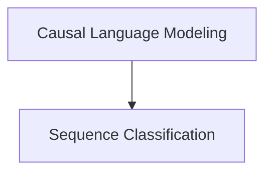

# Zamba Models Documentation

The `zamba_models` module provides implementations of the Zamba model for various natural language processing tasks, including causal language modeling and sequence classification. It leverages a transformer-based architecture to deliver high-performance and flexible model capabilities.

## Architecture Overview

The `zamba_models` module is structured into key sub-modules, each focusing on a specific functionality or model variant. The primary components include implementations for causal language modeling and sequence classification, building upon a shared Zamba model core.

<!-- DIAGRAM_JSON
{
    "direction": "TD",
    "nodes": [
        {"id": "causal_language_modeling", "label": "Causal Language Modeling", "type": "module", "link": "causal_language_modeling.md"},
        {"id": "sequence_classification", "label": "Sequence Classification", "type": "module", "link": "sequence_classification.md"}
    ],
    "edges": [
        {"source": "causal_language_modeling", "target": "sequence_classification"}
    ],
    "groups": []
}
-->

## Sub-modules

### [Causal Language Modeling](causal_language_modeling.md)
This sub-module focuses on the `ZambaForCausalLM` implementation, providing the Zamba model configured for causal language modeling, including text generation capabilities.

### [Sequence Classification](sequence_classification.md)
This sub-module contains the `ZambaForSequenceClassification` implementation, which enables the Zamba model to perform various sequence classification tasks, handling different problem types like regression, single-label, and multi-label classification.