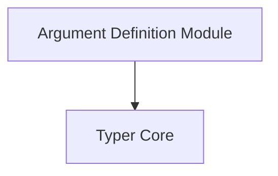

The `argument_definition` module is a specialized component within the Typer framework, focusing exclusively on the definition and management of command-line arguments. It serves as a wrapper and interface for the core `TyperArgument` class, providing a clear and isolated mechanism for handling argument-related configurations.

### Purpose and Core Functionality

The primary purpose of the `argument_definition` module is to encapsulate the logic and properties associated with command-line arguments. Its core component, `typer_core.TyperArgument`, allows developers to define:

*   **Argument Types**: Specify the expected data type for an argument (e.g., `str`, `int`, `Path`).
*   **Default Values**: Provide default values if an argument is not explicitly supplied by the user.
*   **Help Text**: Furnish descriptive help messages for arguments, which are displayed in the CLI's help output.
*   **Validation Rules**: Incorporate validation logic to ensure argument inputs meet specific criteria.

By centralizing these definitions, the module contributes to the clarity, robustness, and maintainability of Typer-based command-line interfaces.

### Architecture and Component Relationships

The `argument_definition` module is a thin abstraction layer over the `typer_core.TyperArgument` class. It doesn't introduce complex internal components but rather exposes the functionalities of `TyperArgument`.

<!-- DIAGRAM_JSON
{
    "direction": "TD",
    "nodes": [
        {"id": "argument_definition_module", "label": "Argument Definition Module", "type": "component", "link": null},
        {"id": "typer_core", "label": "Typer Core", "type": "external", "link": "typer_core.md"}
    ],
    "edges": [
        {"source": "argument_definition_module", "target": "typer_core"}
    ],
    "groups": []
}
-->

The diagram illustrates that the `argument_definition` module directly depends on the `typer_core` module, specifically utilizing the `TyperArgument` class for its core functionality.

### How it Fits into the Overall System

The `argument_definition` module is a sub-module of `parameter_definitions`, which itself is a child of `typer_core`. This hierarchical structure places `argument_definition` as a fundamental building block for defining command parameters within the Typer ecosystem.

*   **Part of Parameter Definitions**: It works in conjunction with the `option_definition` module (its sibling) to collectively define all possible parameters (both arguments and options) for Typer commands.
*   **Integrated with Typer Core**: The definitions created via `argument_definition` are processed by the `typer_core` module, which then uses this information to parse command-line inputs, validate values, and generate help documentation.
*   **Used by Command Management**: Modules like `command_management` and `command_definition` leverage the argument definitions to construct executable commands and groups, ensuring that arguments are correctly integrated into the CLI's structure and behavior.
*   **Foundation for `typer_main`**: Ultimately, the argument definitions contribute to the overall application setup managed by the `typer_main` module, which orchestrates the execution of Typer applications.

By providing a focused and well-defined mechanism for handling arguments, `argument_definition` ensures consistency and ease of use in defining the input interfaces for Typer commands.