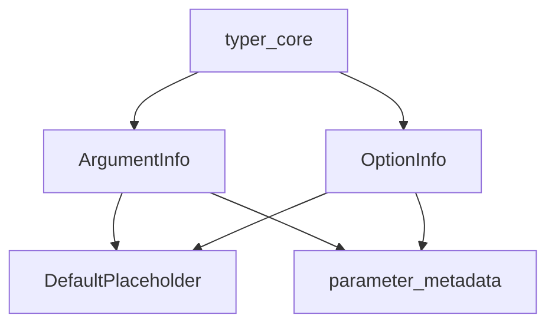

# argument_option_details Module

## Introduction

The `argument_option_details` module is a crucial component within the `typer_models` family, specifically focusing on the detailed definitions for command-line arguments and options. It provides the foundational data structures—`ArgumentInfo`, `OptionInfo`, and `DefaultPlaceholder`—that encapsulate all relevant metadata required for Typer to parse, validate, and process user input from the command line.

This module serves as the bedrock for defining the behavioral and descriptive aspects of individual arguments and options, including their types, default values, help texts, and other configurations. It directly informs how Typer's core command processing functions operate, ensuring consistent and robust handling of CLI parameters.

## Core Functionality and Components

The module defines the following key classes:

### `ArgumentInfo`

The `ArgumentInfo` class holds comprehensive metadata for a command-line argument. This includes information such as its name, type, default value, help string, and any validation rules. It is typically derived from or closely related to the `ParameterInfo` and `ParamMeta` structures defined in the [parameter_metadata](parameter_metadata.md) module, extending them with argument-specific attributes.

### `OptionInfo`

Similar to `ArgumentInfo`, the `OptionInfo` class provides detailed metadata for command-line options. It encompasses data like the option's name (e.g., `--name` or `-n`), type, default value, help text, and whether it's a required or optional parameter. It also builds upon the base parameter metadata from [parameter_metadata](parameter_metadata.md).

### `DefaultPlaceholder`

The `DefaultPlaceholder` class is a utility component used to signify the absence of an explicitly defined default value for an argument or option. It acts as a sentinel value, distinguishing between a `None` default (where `None` is the actual default value) and a parameter where no default has been set by the user or system, requiring Typer to determine the default behavior.

## Architecture and Component Relationships

<!-- DIAGRAM_JSON
{
    "direction": "TD",
    "nodes": [
        {"id": "argument_info", "label": "ArgumentInfo", "type": "component", "link": null},
        {"id": "option_info", "label": "OptionInfo", "type": "component", "link": null},
        {"id": "default_placeholder", "label": "DefaultPlaceholder", "type": "component", "link": null},
        {"id": "parameter_metadata", "label": "parameter_metadata", "type": "external", "link": "parameter_metadata.md"},
        {"id": "typer_core", "label": "typer_core", "type": "external", "link": "typer_core.md"}
    ],
    "edges": [
        {"source": "argument_info", "target": "default_placeholder"},
        {"source": "option_info", "target": "default_placeholder"},
        {"source": "argument_info", "target": "parameter_metadata"},
        {"source": "option_info", "target": "parameter_metadata"},
        {"source": "typer_core", "target": "argument_info"},
        {"source": "typer_core", "target": "option_info"}
    ],
    "groups": []
}
-->

### How it Fits into the Overall System

The `argument_option_details` module resides within the `typer_models` sub-hierarchy, specifically as a child of `parameter_details`. It specializes in providing the concrete data models for arguments and options after they have been generalized by `parameter_metadata`.

-   **Relationship with `parameter_metadata`**: `ArgumentInfo` and `OptionInfo` extend or utilize the concepts and structures defined in the [parameter_metadata](parameter_metadata.md) module, which provides a more abstract definition of parameters (`ParameterInfo`, `ParamMeta`). This module refines those abstractions for the specific contexts of arguments and options.
-   **Input to `typer_core`**: The detailed information encapsulated by `ArgumentInfo` and `OptionInfo` is consumed by the [typer_core](typer_core.md) module. Components like `TyperArgument` and `TyperOption` within `typer_core` rely on these data structures to build the command-line interface, handle parsing, and enforce validation rules.
-   **Overall Flow**: When a Typer application is initialized, information about arguments and options is first processed into the general `ParameterInfo` and `ParamMeta` forms. This module then takes over, providing the specialized `ArgumentInfo` and `OptionInfo` objects that `typer_core` uses to construct the executable command structure. `DefaultPlaceholder` plays a role in correctly interpreting default value states throughout this process.
