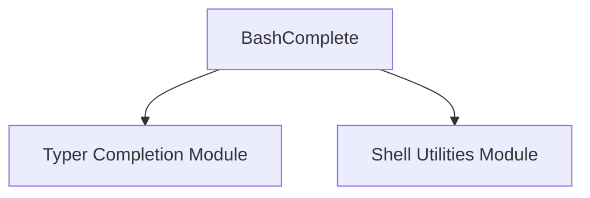

# bash_completion Module Documentation

## Introduction

The `bash_completion` module is a specialized component within the Typer framework, dedicated to generating Bash shell completion scripts. Its primary purpose is to enable Typer CLI applications to provide intelligent auto-completion for commands, arguments, and options when run in a Bash environment, enhancing user experience and productivity.

## Architecture and Component Relationships

The `bash_completion` module focuses on the implementation of Bash-specific completion logic. It encapsulates the `BashComplete` component, which is responsible for the intricate details of generating the completion script in the Bash syntax.

This module is a leaf module within the `typer_completion` family, meaning it doesn't have sub-modules but relies on higher-level modules for integration into the overall completion system. It is a child of the `shell_specific_completion` module, which orchestrates various shell-specific completion implementations.

<!-- DIAGRAM_JSON
{
    "direction": "TD",
    "nodes": [
        {"id": "bash_complete", "label": "BashComplete", "type": "component", "link": null},
        {"id": "typer_completion", "label": "Typer Completion Module", "type": "external", "link": "typer_completion.md"},
        {"id": "shell_utilities", "label": "Shell Utilities Module", "type": "external", "link": "shell_utilities.md"}
    ],
    "edges": [
        {"source": "bash_complete", "target": "typer_completion"},
        {"source": "bash_complete", "target": "shell_utilities"}
    ],
    "groups": []
}
-->

### Components

*   **`BashComplete`**: This is the core component of the `bash_completion` module. It contains the logic necessary to generate shell completion scripts tailored for Bash. This includes handling command parsing, argument and option discovery, and formatting the output according to Bash's programmable completion features.

## How it Fits into the Overall System

The `bash_completion` module plays a crucial role in the `typer_completion` ecosystem by providing the specific implementation for Bash shell completion. It is utilized by the broader [typer_completion.md](typer_completion.md) module to offer a complete shell completion solution across different shells.

When a Typer application needs to generate completion scripts for Bash, the `typer_completion` module will delegate to the `bash_completion` module's `BashComplete` component. This ensures that the generated script is accurate and functional within a Bash environment. It also likely leverages generic shell-related utilities provided by the [shell_utilities.md](shell_utilities.md) module for common tasks such as shell detection or environment variable handling, ensuring consistency and reusability across different shell completion implementations.
