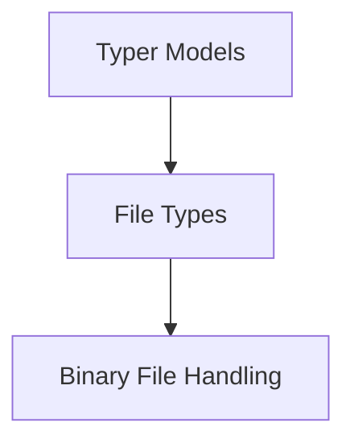

# Binary File Handling Module

## Introduction and Purpose

The `binary_file_handling` module is a specialized component within the larger `typer_models.file_types` module. Its primary purpose is to provide robust and convenient mechanisms for reading from and writing to binary files within Typer applications. This ensures that applications can seamlessly interact with non-textual data, such as images, audio, or serialized data.

This module abstracts away the complexities of low-level binary file operations, offering a declarative way to handle binary input and output through Typer's dependency injection system. It integrates with the broader file type management capabilities provided by the [file_types module](file_types.md).

## Architecture Overview

The `binary_file_handling` module is a focused set of components designed to handle specific binary file operations. It directly exposes classes that can be used within Typer commands to specify binary file inputs and outputs. Its architecture is straightforward, relying on the core Python I/O functionalities.

<!-- DIAGRAM_JSON
{
    "direction": "TD",
    "nodes": [
        {"id": "typer_models", "label": "Typer Models", "type": "module", "link": "typer_models.md"},
        {"id": "file_types", "label": "File Types", "type": "module", "link": "file_types.md"},
        {"id": "binary_file_handling", "label": "Binary File Handling", "type": "module", "link": "binary_file_handling.md"}
    ],
    "edges": [
        {"source": "typer_models", "target": "file_types"},
        {"source": "file_types", "target": "binary_file_handling"}
    ],
    "groups": []
}
-->

## Core Functionality

This module comprises two key components that facilitate binary file operations:

### FileBinaryRead

-   **Purpose**: Represents a dependency that expects a binary file path for reading. When used as a parameter type in a Typer command, it automatically handles opening the file in binary read mode (`'rb'`) and provides the file-like object.
-   **Usage**: Allows Typer applications to easily consume binary input files, ensuring proper handling of non-textual data streams.

### FileBinaryWrite

-   **Purpose**: Represents a dependency that expects a binary file path for writing. Similar to `FileBinaryRead`, it manages opening the file in binary write mode (`'wb'`) and provides the file-like object for output.
-   **Usage**: Enables Typer applications to produce binary output files, such as saving processed images, generated audio, or serialized data structures.
