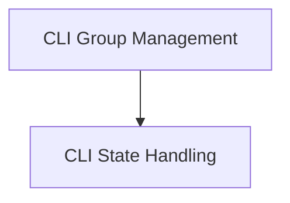

# CLI Group State Module

## Introduction
The `cli_group_state` module, a child of `typer_cli`, is responsible for managing the state and group definitions within Typer Command Line Interface (CLI) applications. It leverages `TyperCLIGroup` to define CLI command groups and `State` to maintain and access application-wide state during execution. This module is crucial for building organized and stateful CLI tools with Typer.

## Architecture
The `cli_group_state` module is composed of two primary sub-modules:

<!-- DIAGRAM_JSON
{
    "direction": "TD",
    "nodes": [
        {"id": "cli_group_management", "label": "CLI Group Management", "type": "module", "link": "cli_group_management.md"},
        {"id": "cli_state_handling", "label": "CLI State Handling", "type": "module", "link": "cli_state_handling.md"}
    ],
    "edges": [
        {"source": "cli_group_management", "target": "cli_state_handling"}
    ],
    "groups": []
}
-->

## Sub-modules Overview

### [CLI Group Management](cli_group_management.md)
This sub-module focuses on the definition and management of CLI command groups. It utilizes the `TyperCLIGroup` component to structure commands hierarchically, allowing for better organization and user experience in complex CLI applications. This component is further detailed in the [typer_cli.md](typer_cli.md) documentation.

### [CLI State Handling](cli_state_handling.md)
This sub-module is dedicated to providing mechanisms for managing application state within the CLI. It uses the `State` component, which allows different parts of the CLI application to share and access common data. This enables the creation of more dynamic and interactive CLI tools. Further information can be found in the [typer_cli.md](typer_cli.md) documentation as well, as `State` is also a core component of `typer_cli`.