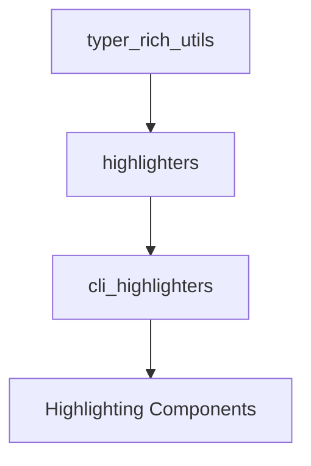

# cli_highlighters Module Documentation

## Introduction

The `cli_highlighters` module provides specialized components for enhancing the command-line interface (CLI) experience through syntax highlighting. It focuses on visually distinguishing various CLI elements, such as metavars (argument placeholders) and options. This module builds upon the foundational highlighting capabilities provided by its parent modules, `highlighters` and `typer_rich_utils`, offering specific implementations tailored for Typer CLIs.

## Architecture

The `cli_highlighters` module is structured to encapsulate the core logic for different types of CLI element highlighting. It contains a single sub-module, `highlighter_components`, which houses the specific highlighter classes. This module integrates with the broader `typer_rich_utils` ecosystem to provide a rich and informative command-line display.

<!-- DIAGRAM_JSON
{
    "direction": "TD",
    "nodes": [
        {"id": "typer_rich_utils", "label": "typer_rich_utils", "type": "external", "link": "typer_rich_utils.md"},
        {"id": "highlighters", "label": "highlighters", "type": "external", "link": "highlighters.md"},
        {"id": "cli_highlighters", "label": "cli_highlighters", "type": "module", "link": "cli_highlighters.md"},
        {"id": "highlighter_components", "label": "Highlighting Components", "type": "module", "link": "highlighter_components.md"}
    ],
    "edges": [
        {"source": "typer_rich_utils", "target": "highlighters"},
        {"source": "highlighters", "target": "cli_highlighters"},
        {"source": "cli_highlighters", "target": "highlighter_components"}
    ],
    "groups": []
}
-->

## Sub-modules

### [Highlighting Components](highlighter_components.md)

This sub-module contains the concrete implementations of the highlighter classes, specifically `MetavarHighlighter`, `OptionHighlighter`, and `NegativeOptionHighlighter`. These components are responsible for applying specific formatting rules to corresponding CLI elements, enhancing readability and user experience.
