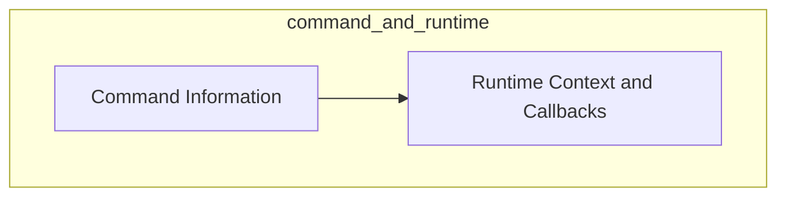

# `command_and_runtime` Module Documentation

## Introduction

The `command_and_runtime` module is a crucial part of the `typer_models` package, specifically nested within `parameter_and_command_info`. It focuses on defining the essential structures and mechanisms for managing command metadata and runtime execution contexts within a Typer application. This module underpins how Typer commands are defined, their associated information is stored, and how callbacks and execution contexts are handled during runtime.

## Architecture Overview

The `command_and_runtime` module is composed of two primary sub-modules: `command_information` and `runtime_context`. These sub-modules work in tandem to provide a robust framework for command management and execution.

- **`command_information`**: This sub-module is responsible for encapsulating the static metadata of commands and general Typer application details. It provides the blueprints for defining what a command is and its inherent properties.
- **`runtime_context`**: This sub-module deals with the dynamic aspects of command execution, managing the current state and parameters available during a command's lifecycle, including how callback functions are handled.

These sub-modules interact by establishing the context within which commands operate, allowing the `command_information` to define the structure that `runtime_context` then populates and utilizes during execution.

<!-- DIAGRAM_JSON
{
    "direction": "TD",
    "nodes": [
        {"id": "command_information", "label": "Command Information", "type": "module", "link": "command_information.md"},
        {"id": "runtime_context", "label": "Runtime Context and Callbacks", "type": "module", "link": "runtime_context.md"}
    ],
    "edges": [
        {"source": "command_information", "target": "runtime_context"}
    ],
    "groups": []
}
-->

## Sub-modules

### `command_information`

This sub-module defines structures like `CommandInfo` and `TyperInfo`, which are crucial for holding metadata about individual commands and the overall Typer application. It provides the foundational data structures for understanding and managing commands.

For more details, refer to the [command_information documentation](command_information.md).

### `runtime_context`

The `runtime_context` sub-module focuses on the dynamic aspects of command execution. It includes components like `Context` for managing the current execution context and `CallbackParam` for handling parameters that involve callback functions. This module is essential for controlling the flow and state during command invocation.

For more details, refer to the [runtime_context documentation](runtime_context.md).
