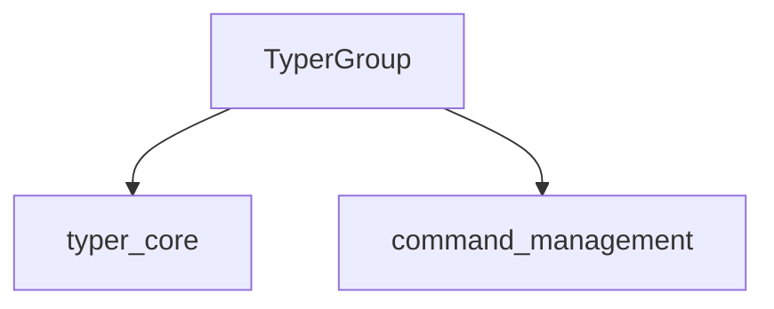

# command_group Module Documentation

## Introduction
The `command_group` module, a sub-module of `command_management` within `typer_core`, is responsible for defining and managing groups of commands in Typer applications. Its primary component, `typer_core.TyperGroup`, facilitates the organization of multiple commands under a single, cohesive interface.

## Core Functionality
The `command_group` module focuses on the `typer_core.TyperGroup` component, which extends the capabilities provided by `typer_core`. `TyperGroup` allows developers to create hierarchical command structures, making complex command-line interfaces more organized and user-friendly. It enables nesting commands and applying common options or arguments to an entire group.

## Architecture and Component Relationships

<!-- DIAGRAM_JSON
{
    "direction": "TD",
    "nodes": [
        {"id": "typer_group", "label": "TyperGroup", "type": "component", "link": null},
        {"id": "typer_core", "label": "typer_core", "type": "external", "link": "typer_core.md"},
        {"id": "command_management", "label": "command_management", "type": "external", "link": "command_management.md"}
    ],
    "edges": [
        {"source": "typer_group", "target": "typer_core"},
        {"source": "typer_group", "target": "command_management"}
    ],
    "groups": []
}
-->

The `typer_core.TyperGroup` component is the central element of this module. It relies on foundational structures provided by the [typer_core documentation](typer_core.md) module for its basic command handling capabilities. Furthermore, `command_group` is a child of `command_management`, indicating its role as a specialized aspect of broader command organization.

## Integration with the Overall System
The `command_group` module plays a crucial role in enhancing the structure and navigability of Typer CLIs. By abstracting related commands into groups, it contributes to a more modular and maintainable application design. It integrates seamlessly with the `typer_core`'s command and argument definitions, allowing for rich and expressive command-line interfaces. For more details on the core command and argument definitions, refer to the [typer_core documentation](typer_core.md). For information on how commands are managed more broadly, see the [command_management documentation](command_management.md).