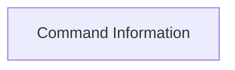

# Command Information

Defines structures for command metadata and Typer application details.

## Components

This module contains 2 component(s):

- `CommandInfo`
- `TyperInfo`

## Structure

---
*This documentation was auto-generated to ensure completeness.*
