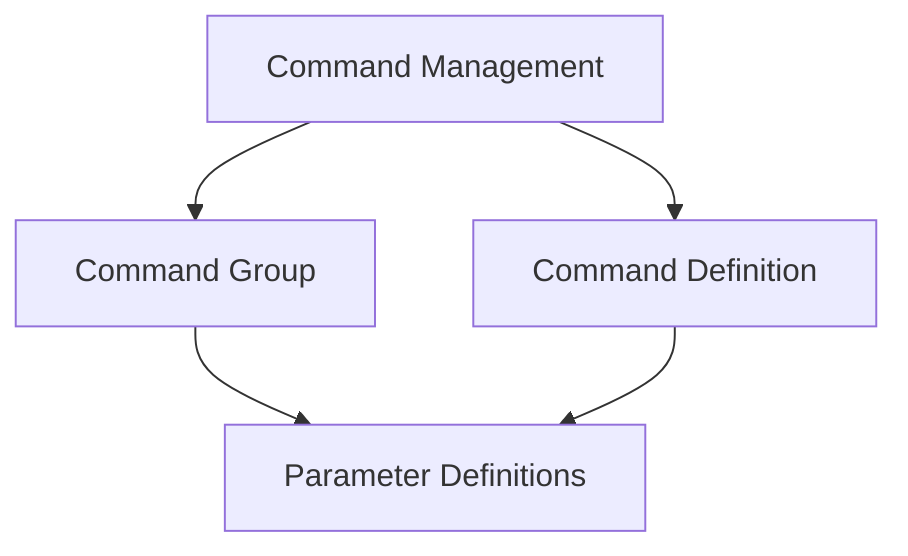

# Command Management Module

## Introduction

The `command_management` module, part of `typer_core`, is fundamental for structuring and defining commands within a Typer Command Line Interface (CLI) application. It provides the core abstractions for organizing commands into logical groups and defining the execution logic for individual commands. This module works in conjunction with `parameter_definitions` to fully specify command-line interfaces.

## Architecture

The `command_management` module is composed of two primary sub-modules: `command_group` and `command_definition`. These sub-modules encapsulate the logic for creating nested command structures and defining executable commands, respectively. It relies on components defined in the `typer_core` parent module and collaborates closely with `parameter_definitions` for argument and option handling.

<!-- DIAGRAM_JSON
{
    "direction": "TD",
    "nodes": [
        {"id": "command_management", "label": "Command Management", "type": "module"},
        {"id": "command_group", "label": "Command Group", "type": "module", "link": "command_group.md"},
        {"id": "command_definition", "label": "Command Definition", "type": "module", "link": "command_definition.md"},
        {"id": "parameter_definitions", "label": "Parameter Definitions", "type": "module", "link": "parameter_definitions.md"}
    ],
    "edges": [
        {"source": "command_management", "target": "command_group"},
        {"source": "command_management", "target": "command_definition"},
        {"source": "command_group", "target": "parameter_definitions"},
        {"source": "command_definition", "target": "parameter_definitions"}
    ],
    "groups": []
}
-->

## Sub-modules and Functionality

### Command Group ([command_group.md](command_group.md))
This sub-module focuses on the `TyperGroup` component, enabling the creation of hierarchical command structures. It allows developers to organize related commands under a single parent group, improving the clarity and usability of complex CLI applications.

### Command Definition ([command_definition.md](command_definition.md))
The `command_definition` sub-module encapsulates the `TyperCommand` component. It is responsible for defining individual executable commands, including their help text, callbacks, and other metadata necessary for the Typer CLI to function correctly.

## Related Modules

### Parameter Definitions ([parameter_definitions.md](parameter_definitions.md))
The `parameter_definitions` module is a sibling to `command_management` within `typer_core`. It defines how arguments and options are handled for commands and groups. Components like `TyperArgument` and `TyperOption` from this module are crucial for specifying the input parameters for any command defined using `command_management`. This module is directly referenced by both command groups and individual commands for parameter processing.
