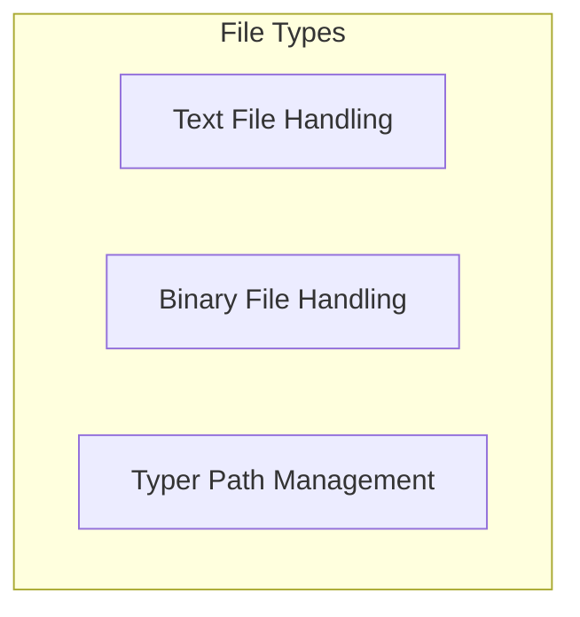

# File Types Module

## Introduction
The `file_types` module in Typer provides a robust set of utilities for handling various file operations, including reading and writing both text and binary files, and managing file paths. It standardizes how Typer applications interact with the file system, ensuring consistency and ease of use.

## Architecture Overview
The `file_types` module is structured into several sub-modules, each focusing on a specific aspect of file handling. This modular design allows for clear separation of concerns and facilitates maintainability.

<!-- DIAGRAM_JSON
{
    "direction": "TD",
    "nodes": [
        {"id": "text_file_handling", "label": "Text File Handling", "type": "module", "link": "text_file_handling.md"},
        {"id": "binary_file_handling", "label": "Binary File Handling", "type": "module", "link": "binary_file_handling.md"},
        {"id": "path_management", "label": "Typer Path Management", "type": "module", "link": "path_management.md"}
    ],
    "edges": [],
    "groups": []
}
-->

## Sub-modules

### [Text File Handling](text_file_handling.md)
This sub-module focuses on managing operations related to reading and writing text files within Typer applications. It includes components like `FileText` for reading and `FileTextWrite` for writing textual content, ensuring seamless interaction with text-based files.

### [Binary File Handling](binary_file_handling.md)
The binary file handling sub-module is responsible for operations involving non-textual data. It handles reading and writing binary data to files using components such as `FileBinaryRead` and `FileBinaryWrite`, providing robust tools for various binary file operations.

### [Typer Path Management](path_management.md)
This sub-module provides a specialized path type, `TyperPath`, designed to enhance file path handling and validation within Typer. It facilitates more robust and secure management of file system paths for application needs.
