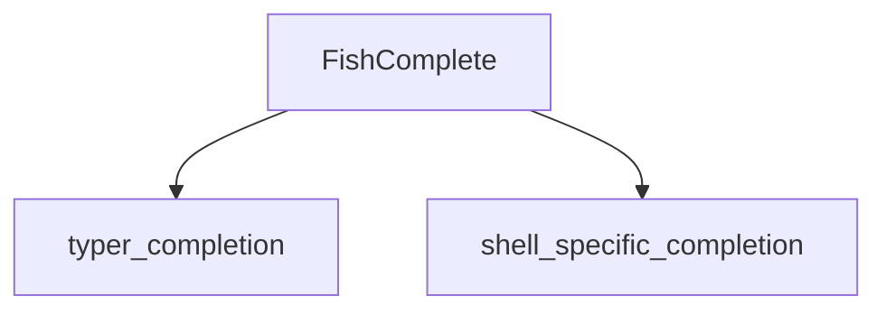

# `fish_completion` Module Documentation

## Introduction

The `fish_completion` module is a specialized component within the `typer_completion` ecosystem, solely focused on generating shell completion scripts for the [Fish shell](https://fishshell.com/). It encapsulates the logic and utilities required to provide robust command-line completion capabilities specifically tailored for Fish users, enhancing the user experience by offering dynamic suggestions and argument hints.

## Architecture and Component Relationships

This module primarily revolves around its core component, `FishComplete`, which is responsible for the intricate details of generating Fish-specific completion commands. It acts as a leaf module in the `typer_completion` hierarchy, leveraging functionalities provided by its parent modules.

`fish_completion` integrates with the broader completion system, specifically depending on the overarching `typer_completion` module for general completion logic and `shell_specific_completion` for managing shell-specific completion strategies.

<!-- DIAGRAM_JSON
{
    "direction": "TD",
    "nodes": [
        {"id": "fish_complete", "label": "FishComplete", "type": "component", "link": null},
        {"id": "typer_completion", "label": "typer_completion", "type": "external", "link": "typer_completion.md"},
        {"id": "shell_specific_completion", "label": "shell_specific_completion", "type": "external", "link": "shell_specific_completion.md"}
    ],
    "edges": [
        {"source": "fish_complete", "target": "typer_completion"},
        {"source": "fish_complete", "target": "shell_specific_completion"}
    ],
    "groups": []
}
-->

## How it Fits into the Overall System

The `fish_completion` module plays a crucial role in the `typer` framework's commitment to providing comprehensive shell integration. It ensures that applications built with `Typer` can offer native and efficient command-line completion for users of the Fish shell. By isolating Fish-specific logic, it maintains modularity and allows for easier maintenance and extension of completion features across different shells.

This module is a direct specialization of the `shell_specific_completion` module, inheriting the general structure for handling shell completions and then implementing the unique requirements for Fish. It ultimately contributes to the overall goal of the `typer_completion` module to provide a unified and extensible completion system for various shell environments. For more information on the general completion system, refer to the [typer_completion documentation](typer_completion.md) and [shell_specific_completion documentation](shell_specific_completion.md).
