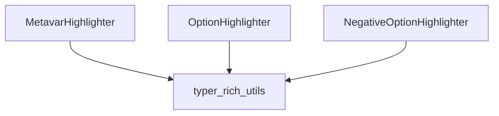

# highlighter_components Module Documentation

## Introduction

The `highlighter_components` module provides a set of specialized highlighters crucial for enhancing the command-line interface (CLI) user experience within applications built with Typer. These components are designed to visually distinguish different parts of CLI commands, such as metavar arguments, options, and negative options, thereby improving readability and user comprehension.

## Core Functionality

This module defines the concrete implementations of several highlighter components:

*   **MetavarHighlighter**: Responsible for highlighting metavariables in CLI help messages and usage strings. Metavariables typically represent the type or purpose of an argument (e.g., `[TEXT]`, `[PATH]`).
*   **OptionHighlighter**: Focuses on highlighting command-line options (e.g., `--help`, `-v`, `--name <NAME>`). This helps users quickly identify available options and their associated values.
*   **NegativeOptionHighlighter**: Specifically designed to highlight "negative" or "no-" options (e.g., `--no-install`). These options often negate a default behavior and are important for users to recognize.

These highlighters leverage the `rich` library's capabilities through the `typer_rich_utils` module to apply rich text styling and formatting to CLI output.

## Architecture and Component Relationships

The `highlighter_components` module serves as the foundational layer for specific CLI highlighting functionalities. Its components are utilized by higher-level modules within the Typer ecosystem to render well-formatted and easy-to-understand CLI output.

<!-- DIAGRAM_JSON
{
    "direction": "TD",
    "nodes": [
        {"id": "metavar_highlighter", "label": "MetavarHighlighter", "type": "component", "link": null},
        {"id": "option_highlighter", "label": "OptionHighlighter", "type": "component", "link": null},
        {"id": "negative_option_highlighter", "label": "NegativeOptionHighlighter", "type": "component", "link": null},
        {"id": "typer_rich_utils", "label": "typer_rich_utils", "type": "external", "link": "typer_rich_utils.md"}
    ],
    "edges": [
        {"source": "metavar_highlighter", "target": "typer_rich_utils"},
        {"source": "option_highlighter", "target": "typer_rich_utils"},
        {"source": "negative_option_highlighter", "target": "typer_rich_utils"}
    ],
    "groups": []
}
-->

## How the Module Fits into the Overall System

The `highlighter_components` module is an integral part of Typer's rich output capabilities, residing within the `typer_rich_utils` family of modules. It provides the specific highlighter implementations that `typer_rich_utils.highlighters` and `typer_rich_utils.highlighters.cli_highlighters` orchestrate to apply syntax highlighting to CLI elements. By offering distinct components for metavariables, options, and negative options, it enables granular control over how different parts of a command are presented to the user. This significantly contributes to Typer's goal of creating user-friendly and visually appealing command-line applications.

For more information on the overarching rich utilities, refer to the [typer_rich_utils](typer_rich_utils.md) documentation.