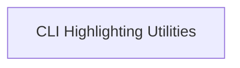

# Highlighters Module

## Introduction

The `highlighters` module, part of `typer_rich_utils`, provides specialized classes for enhancing the visual presentation of command-line interface (CLI) elements. It focuses on highlighting different parts of CLI output, such as metavar and options, to improve readability and user experience. This module is essential for applications built with Typer that leverage rich output capabilities.

## Architecture

The `highlighters` module is structured around a single sub-module that encapsulates various highlighting functionalities. This design promotes modularity and allows for easy extension of highlighting features.

<!-- DIAGRAM_JSON
{
    "direction": "TD",
    "nodes": [
        {"id": "cli_highlighters", "label": "CLI Highlighting Utilities", "type": "module", "link": "cli_highlighters.md"}
    ],
    "edges": [],
    "groups": []
}
-->

## Sub-modules

### CLI Highlighting Utilities ([`cli_highlighters.md`](cli_highlighters.md))

This sub-module, documented in `cli_highlighters.md`, contains the core components responsible for different types of highlighting within a Typer application. It includes:

*   **MetavarHighlighter**: Responsible for highlighting metavars.
*   **OptionHighlighter**: Handles highlighting of CLI options.
*   **NegativeOptionHighlighter**: Provides functionality for highlighting negative options.

These components work together to provide a comprehensive and customizable highlighting system for Typer-based CLIs.