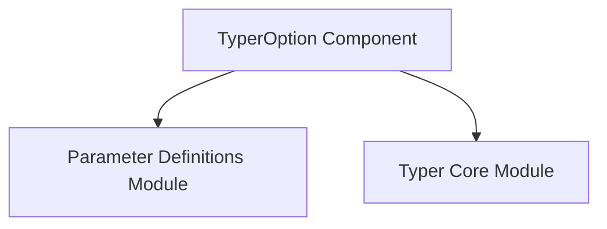

# option_definition Module Documentation

## Introduction

The `option_definition` module is a specialized leaf module within the `typer_core.parameter_definitions` sub-system. Its primary purpose is to encapsulate the definition and handling of command-line options in Typer applications, focusing on the `TyperOption` component.

## Core Functionality

This module revolves around the `TyperOption` component, which is responsible for defining command-line options. Options are typically optional parameters prefixed with `--` or `-`, providing configurable behavior to commands. `TyperOption` allows developers to define various attributes for an option, including:

*   **Name:** The identifier for the option.
*   **Default Value:** A value used if the option is not provided by the user.
*   **Help Text:** A descriptive string for documentation and user assistance.
*   **Required Status:** Indicates whether the option must be provided by the user.
*   **Type Hinting:** Supports Python type hints for automatic validation and parsing.

By centralizing the definition of options, `option_definition` ensures consistency and simplifies the process of creating robust command-line interfaces.

## Architecture and Component Relationships

The `option_definition` module is a fine-grained component within the Typer framework. It directly utilizes and is conceptually represented by the `typer_core.TyperOption` class. It is grouped under the `parameter_definitions` module, which provides a logical container for all parameter-related definitions, including both arguments and options.

<!-- DIAGRAM_JSON
{
    "direction": "TD",
    "nodes": [
        {"id": "typer_option", "label": "TyperOption Component", "type": "component", "link": null},
        {"id": "parameter_definitions", "label": "Parameter Definitions Module", "type": "external", "link": "parameter_definitions.md"},
        {"id": "typer_core", "label": "Typer Core Module", "type": "external", "link": "typer_core.md"}
    ],
    "edges": [
        {"source": "typer_option", "target": "parameter_definitions"},
        {"source": "typer_option", "target": "typer_core"}
    ],
    "groups": []
}
-->

## How it Fits into the Overall System

The `option_definition` module is a foundational piece for building interactive command-line applications with Typer. It provides the essential mechanism for developers to define and customize command-line options. When a Typer command is constructed (e.g., through components in the [command_definition.md](command_definition.md) or [command_group.md](command_group.md) modules, which depend on [typer_core.md](typer_core.md)), it leverages the `TyperOption` definitions provided by this module (indirectly via `typer_core`) to parse and handle user-supplied options.

It works in close conjunction with the [argument_definition.md](argument_definition.md) module, which defines command-line arguments. Together, these two modules form the complete set of parameter definitions for any given command, enabling Typer to create flexible and user-friendly command-line interfaces.