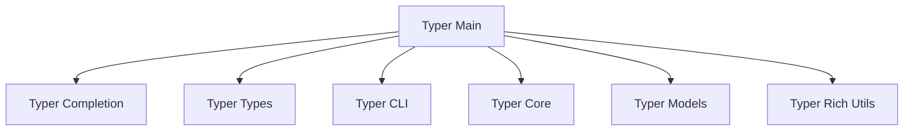

The `typer` repository contains the source code for the Typer framework, a modern, fast, and easy-to-use library for building command-line interface (CLI) applications in Python. It leverages Python type hints to automatically define commands, arguments, and options, providing features like automatic shell completion, rich terminal output, and robust parameter validation. The framework is designed to simplify CLI development by abstracting away much of the boilerplate typically associated with parsing command-line inputs and generating help messages, enabling developers to create powerful and user-friendly CLIs with minimal effort.

### Architecture Overview

The core of the Typer framework is the `Typer` class, found within the `typer_main` module. This central component orchestrates the entire CLI application, integrating functionality from various other modules to provide a comprehensive set of features. The diagram below illustrates the main modules and their relationships with the `Typer` application core.

