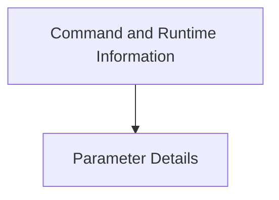

# Parameter and Command Information Module

The `parameter_and_command_info` module is a crucial part of the Typer framework, responsible for defining and managing the metadata associated with command-line parameters, arguments, options, and overall command structures. It provides the foundational classes for how Typer interprets and processes user input, enabling rich command-line interfaces.

This module integrates with `typer_core` (for `TyperArgument`, `TyperOption`, `TyperCommand`) and `typer_main` (for `Typer`) to facilitate the declaration and handling of CLI components.

## Architecture Overview

The `parameter_and_command_info` module is logically divided into two primary sub-modules:

*   **Command and Runtime Information (`command_and_runtime.md`)**: Focuses on metadata related to the commands themselves and the context in which they execute.
*   **Parameter Details (`parameter_details.md`)**: Handles the specifics of individual parameters, arguments, and options.

<!-- DIAGRAM_JSON
{
    "direction": "TD",
    "nodes": [
        {"id": "command_and_runtime", "label": "Command and Runtime Information", "type": "module", "link": "command_and_runtime.md"},
        {"id": "parameter_details", "label": "Parameter Details", "type": "module", "link": "parameter_details.md"}
    ],
    "edges": [
        {"source": "command_and_runtime", "target": "parameter_details"}
    ],
    "groups": []
}
-->

## Sub-modules

### [Command and Runtime Information](command_and_runtime.md)
This sub-module centralizes classes like `CommandInfo`, `Context`, `CallbackParam`, and `TyperInfo`. It is responsible for holding metadata about a command, managing the execution context, defining callback parameters for advanced functionality, and providing general Typer application information. It ensures that commands operate within a well-defined environment and can leverage Typer's advanced features.

### [Parameter Details](parameter_details.md)
This sub-module encompasses `ParameterInfo`, `ParamMeta`, `ArgumentInfo`, `OptionInfo`, and `DefaultPlaceholder`. It is dedicated to describing the specifics of command-line parameters, including whether they are arguments or options, their default values, and any additional metadata required for validation or help text generation. This module is essential for Typer to correctly parse and validate user-provided input against the expected command signature.