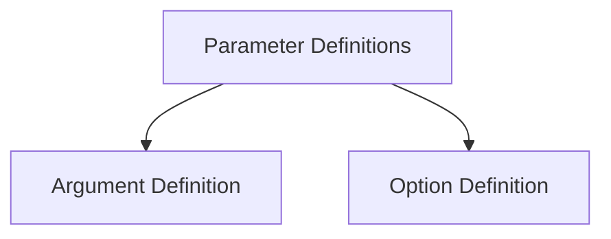

# Parameter Definitions Module

The `parameter_definitions` module is responsible for defining the various types of parameters that can be used in Typer commands, specifically focusing on command-line arguments and options. It leverages core components from `typer_core` to provide a robust and flexible way to specify how input values are expected and processed.

## Architecture

The module is structured into two main sub-modules, each handling a distinct aspect of parameter definition:

*   **Argument Definition**: Manages the definition and behavior of command-line arguments.
*   **Option Definition**: Handles the definition and behavior of command-line options.

<!-- DIAGRAM_JSON
{
    "direction": "TD",
    "nodes": [
        {"id": "argument_definition", "label": "Argument Definition", "type": "module", "link": "argument_definition.md"},
        {"id": "option_definition", "label": "Option Definition", "type": "module", "link": "option_definition.md"}
    ],
    "edges": [
        {"source": "parameter_definitions", "target": "argument_definition"},
        {"source": "parameter_definitions", "target": "option_definition"}
    ],
    "groups": []
}
-->

## Sub-modules

### [Argument Definition](argument_definition.md)

This sub-module is dedicated to defining command-line arguments. It utilizes `typer_core.TyperArgument` to specify how arguments are processed, including their types, default values, and help messages. For more details, refer to the [Argument Definition documentation](argument_definition.md).

### [Option Definition](option_definition.md)

The `option_definition` sub-module focuses on the definition of command-line options. It uses `typer_core.TyperOption` to configure options, allowing for various settings such as short names, required status, and multiple values. For further information, see the [Option Definition documentation](option_definition.md).
