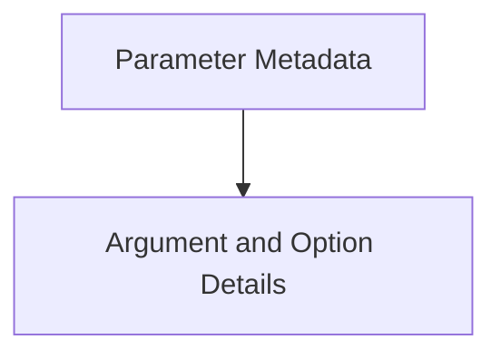

# Parameter Details Module

The `parameter_details` module in Typer is responsible for defining the detailed metadata and structural information for command-line parameters. It provides the foundational classes to represent arguments, options, and their associated default values and meta-information, crucial for Typer's command-line interface generation and parsing.

## Architecture Overview

This module is a core component within the `typer_models.parameter_and_command_info` hierarchy. It focuses specifically on the granular details of individual parameters, distinguishing between arguments and options, and managing their default values and various metadata. It serves as the bedrock for how Typer understands and processes user-defined parameters for CLI commands.

<!-- DIAGRAM_JSON
{
    "direction": "TD",
    "nodes": [
        {"id": "parameter_metadata", "label": "Parameter Metadata", "type": "module", "link": "parameter_metadata.md"},
        {"id": "argument_option_details", "label": "Argument and Option Details", "type": "module", "link": "argument_option_details.md"}
    ],
    "edges": [
        {"source": "parameter_metadata", "target": "argument_option_details"}
    ],
    "groups": []
}
-->

## Sub-modules

### [Parameter Metadata](parameter_metadata.md)
This sub-module defines the base information and metadata for command parameters, including classes like `ParameterInfo` and `ParamMeta`.

### [Argument and Option Details](argument_option_details.md)
This sub-module specifies the detailed characteristics for command-line arguments, options, and how default values are handled, encompassing classes such as `ArgumentInfo`, `OptionInfo`, and `DefaultPlaceholder`.
