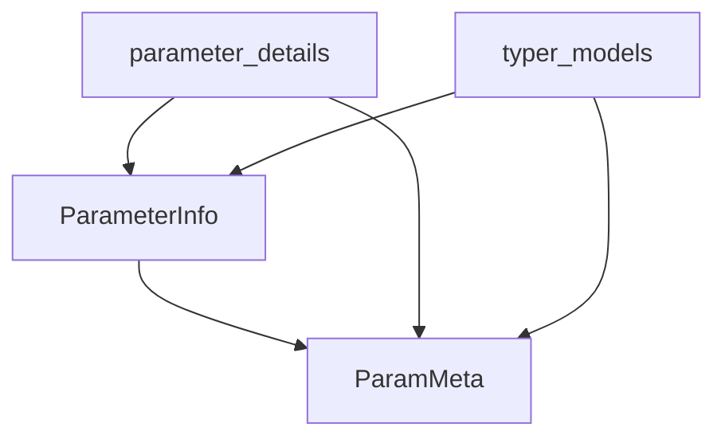

# parameter_metadata Module Documentation

The `parameter_metadata` module is a foundational component within Typer's `typer_models` ecosystem, specifically designed to encapsulate the core metadata about command parameters. It provides essential data structures that define the characteristics and behavior of both arguments and options in a command-line interface.

## Purpose and Core Functionality

This module defines the fundamental classes used to store descriptive information for CLI parameters. Its primary responsibility is to offer a standardized way to manage properties such as default values, help messages, and other crucial attributes that influence how Typer processes and presents parameters.

### Core Components

*   **`ParameterInfo`**: This class extends `ParamMeta` and serves as a comprehensive container for detailed information about a specific command parameter. It holds attributes like the default value, help text, various flags, and other settings necessary for Typer to correctly interpret and display the parameter.
*   **`ParamMeta`**: As a base class, `ParamMeta` provides a common set of metadata attributes that are shared across various parameter types. `ParameterInfo` inherits from this class, leveraging its foundational structure for parameter description.

## Architecture and Component Relationships

The `parameter_metadata` module acts as a specialized sub-module within the broader `parameter_details` context. It isolates the definition of core parameter metadata classes, making them reusable and central to how Typer's models represent CLI inputs.

<!-- DIAGRAM_JSON
{
    "direction": "TD",
    "nodes": [
        {"id": "parameter_info", "label": "ParameterInfo", "type": "component", "link": null},
        {"id": "param_meta", "label": "ParamMeta", "type": "component", "link": null},
        {"id": "parameter_details", "label": "parameter_details", "type": "external", "link": "parameter_details.md"},
        {"id": "typer_models", "label": "typer_models", "type": "external", "link": "typer_models.md"}
    ],
    "edges": [
        {"source": "parameter_info", "target": "param_meta"},
        {"source": "parameter_details", "target": "parameter_info"},
        {"source": "parameter_details", "target": "param_meta"},
        {"source": "typer_models", "target": "parameter_info"},
        {"source": "typer_models", "target": "param_meta"}
    ],
    "groups": []
}
-->

## How the Module Fits into the Overall System

The `parameter_metadata` module is a critical foundational layer for defining how command-line parameters are structured and described.

*   **`parameter_details`**: This module directly utilizes `ParameterInfo` and `ParamMeta` to build more specific parameter types, such as `ArgumentInfo` and `OptionInfo`, which are detailed in [parameter_details.md](parameter_details.md).
*   **`parameter_and_command_info`**: As a parent module to `parameter_details`, `parameter_and_command_info` inherently relies on the metadata defined here to manage the overall structure of command parameters. Refer to [parameter_and_command_info.md](parameter_and_command_info.md) for more details.
*   **`typer_models`**: The overarching `typer_models` module integrates these metadata classes to create a complete and cohesive representation of Typer applications, commands, and their parameters. This allows for robust parsing, validation, and documentation generation. See [typer_models.md](typer_models.md) for further information.

By providing these core metadata definitions, `parameter_metadata` ensures consistency and clarity in how parameters are handled across the Typer framework, enabling other modules to build upon a solid, well-defined foundation.
