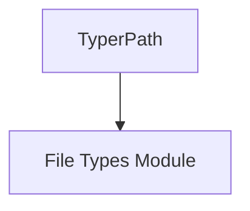

# path_management

## Introduction

The `path_management` module, a sub-module of `typer_models.file_types`, is dedicated to managing file paths within Typer applications. Its core component, `TyperPath`, provides a robust and convenient way to handle file system paths as command-line arguments, integrating seamlessly with Typer's parameter handling.

## Core Functionality

The primary responsibility of `path_management` is to provide the `TyperPath` component. `TyperPath` is designed to extend the functionality of standard file path handling, offering features pertinent to command-line interfaces, such as automatic path validation and flexible input/output capabilities. It allows developers to easily define command-line arguments that expect file or directory paths, ensuring proper interaction with the file system.

## Architecture and Component Relationships

The `path_management` module is a focused component that primarily exposes the `TyperPath` class. It integrates directly with the `file_types` module, which orchestrates various file-related operations, including binary and text file handling. `TyperPath` serves as a foundational element for these specialized file types, providing the underlying path resolution and validation capabilities.

<!-- DIAGRAM_JSON
{
    "direction": "TD",
    "nodes": [
        {"id": "typer_path", "label": "TyperPath", "type": "component", "link": null},
        {"id": "file_types", "label": "File Types Module", "type": "external", "link": "file_types.md"}
    ],
    "edges": [
        {"source": "typer_path", "target": "file_types"}
    ],
    "groups": []
}
-->

## How it Fits into the Overall System

The `path_management` module is a crucial part of Typer's robust argument and option handling system, particularly for commands that interact with the file system. By providing `TyperPath`, it simplifies the process of defining file and directory path arguments, ensuring type safety and consistency across different Typer applications. It underpins the more specialized file handling capabilities found in the [file_types module](file_types.md), enabling Typer to effectively manage various file input/output scenarios through the command line.