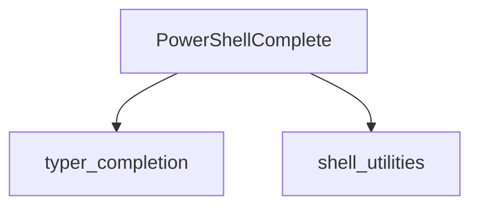

# `powershell_completion` Module

## Introduction

The `powershell_completion` module is a dedicated component within the Typer completion system, specifically designed to generate and manage shell completion scripts for PowerShell. It ensures that Typer-based command-line applications can offer intelligent auto-completion capabilities to users operating in a PowerShell environment.

## Core Functionality

This module's primary responsibility is to provide the necessary logic and tools for integrating Typer applications with PowerShell's completion mechanism. It focuses on the `PowerShellComplete` component, which is central to enabling a smooth and efficient command-line experience for PowerShell users.

### `PowerShellComplete`

The `PowerShellComplete` component is the core of this module. It is responsible for:

*   Generating PowerShell-specific completion scripts.
*   Interfacing with the Typer application's command structure to extract necessary information for completion.
*   Providing the completion logic that PowerShell uses to suggest commands, arguments, and options.

## Architecture and Component Relationships

The `powershell_completion` module is a specialized part of the broader [typer_completion](typer_completion.md) system. It relies on the overarching completion framework provided by `typer_completion` to function correctly. Additionally, it may interact with [shell_utilities](shell_utilities.md) for general shell-related helper functions.

<!-- DIAGRAM_JSON
{
    "direction": "TD",
    "nodes": [
        {"id": "powershell_complete", "label": "PowerShellComplete", "type": "component", "link": null},
        {"id": "typer_completion", "label": "typer_completion", "type": "external", "link": "typer_completion.md"},
        {"id": "shell_utilities", "label": "shell_utilities", "type": "external", "link": "shell_utilities.md"}
    ],
    "edges": [
        {"source": "powershell_complete", "target": "typer_completion"},
        {"source": "powershell_complete", "target": "shell_utilities"}
    ],
    "groups": []
}
-->

