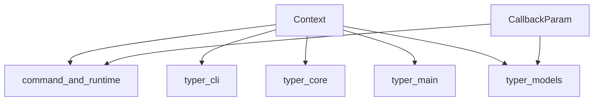

# Module: runtime_context

## Introduction
The `runtime_context` module is a crucial component within the Typer framework, specifically designed to manage and provide access to the runtime state and callback parameters during the execution of a Typer command. It encapsulates essential information required for commands and callbacks to operate effectively, ensuring a consistent and predictable environment.

## Purpose and Core Functionality
This module serves as the central hub for runtime-specific data, enabling different parts of a Typer application to interact with and react to the current execution context. Its primary purpose is to:
*   **Manage Runtime Context**: Provide a container for the current state of a running Typer application, including command-specific data, and other contextual information.
*   **Facilitate Callback Execution**: Define the structure for callback parameters, allowing Typer to correctly invoke and pass necessary arguments to pre-defined callback functions.

### Core Components:

#### `Context`
The `Context` object represents the runtime context of a Typer application. It holds various pieces of information accessible during command execution and within callbacks. This includes details about the invoked command, its arguments, options, and potentially user-defined state. The `Context` object is fundamental for advanced features like dependency injection, error handling, and accessing global application state. For a broader understanding of the `Context` object and its role in command execution, refer to the [command_and_runtime](command_and_runtime.md) documentation.

#### `CallbackParam`
The `CallbackParam` component is a specialized type used to define parameters that are expected by callback functions in Typer. It ensures that when a callback is triggered, the correct arguments are provided based on the application's runtime state. This enables flexible and powerful pre-processing or post-processing logic before or after a command executes. For more details on how `CallbackParam` integrates with command information, see the [command_and_runtime](command_and_runtime.md) module.

## Architecture and Component Relationships

The `runtime_context` module provides the foundational components for handling runtime data and callback mechanics. It is tightly integrated with its parent module, [command_and_runtime](command_and_runtime.md), which orchestrates how commands are executed and how their contexts are managed. It also interacts with other modules that define how parameters are interpreted and how the overall Typer application operates.

<!-- DIAGRAM_JSON
{
    "direction": "TD",
    "nodes": [
        {"id": "context", "label": "Context", "type": "component", "link": null},
        {"id": "callback_param", "label": "CallbackParam", "type": "component", "link": null},
        {"id": "command_and_runtime", "label": "command_and_runtime", "type": "external", "link": "command_and_runtime.md"},
        {"id": "typer_models", "label": "typer_models", "type": "external", "link": "typer_models.md"},
        {"id": "typer_cli", "label": "typer_cli", "type": "external", "link": "typer_cli.md"},
        {"id": "typer_core", "label": "typer_core", "type": "external", "link": "typer_core.md"},
        {"id": "typer_main", "label": "typer_main", "type": "external", "link": "typer_main.md"}
    ],
    "edges": [
        {"source": "context", "target": "command_and_runtime"},
        {"source": "callback_param", "target": "command_and_runtime"},
        {"source": "context", "target": "typer_cli"},
        {"source": "context", "target": "typer_core"},
        {"source": "context", "target": "typer_main"},
        {"source": "context", "target": "typer_models"},
        {"source": "callback_param", "target": "typer_models"}
    ],
    "groups": []
}
-->

## How the Module Fits into the Overall System
The `runtime_context` module is a foundational layer for managing the dynamic state of a Typer application.
*   It provides the `Context` object which is passed around throughout the Typer command lifecycle, from parsing arguments and options to executing the main command function and its callbacks.
*   It defines `CallbackParam`, crucial for allowing functions to receive specific arguments based on the runtime context, enabling features like dependency injection for callbacks.
*   It underpins the functionality of modules like [typer_cli](typer_cli.md) (which might use `Context` for its `State` object), [typer_core](typer_core.md) (where `TyperCommand` and `TyperGroup` utilize context), and [typer_main](typer_main.md) (where the main `Typer` application manages the overall context).
*   Ultimately, it enables the flexible and robust execution of command-line applications built with Typer by providing a standardized way to access and manipulate runtime information.
