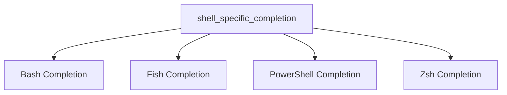

# Shell-Specific Completion Module

The `shell_specific_completion` module in the Typer framework is responsible for providing robust and dynamic command-line completion functionalities tailored for various shell environments. It ensures that Typer applications offer a seamless and intuitive user experience by automatically suggesting commands, arguments, and options as the user types.

This module integrates with common shells like Bash, Zsh, Fish, and PowerShell, abstracting away the complexities of each shell's completion mechanisms to provide a unified completion system for Typer applications.

## Architecture

The `shell_specific_completion` module is composed of several sub-modules, each dedicated to handling completion logic for a specific shell. This modular design allows for independent development and maintenance of shell-specific behaviors while maintaining a consistent interface for the main Typer completion system.

<!-- DIAGRAM_JSON
{
    "direction": "TD",
    "nodes": [
        {"id": "bash_completion", "label": "Bash Completion", "type": "module", "link": "bash_completion.md"},
        {"id": "fish_completion", "label": "Fish Completion", "type": "module", "link": "fish_completion.md"},
        {"id": "powershell_completion", "label": "PowerShell Completion", "type": "module", "link": "powershell_completion.md"},
        {"id": "zsh_completion", "label": "Zsh Completion", "type": "module", "link": "zsh_completion.md"}
    ],
    "edges": [
        {"source": "shell_specific_completion", "target": "bash_completion"},
        {"source": "shell_specific_completion", "target": "fish_completion"},
        {"source": "shell_specific_completion", "target": "powershell_completion"},
        {"source": "shell_specific_completion", "target": "zsh_completion"}
    ],
    "groups": []
}
-->

## Sub-modules

This section provides a high-level overview of the sub-modules within `shell_specific_completion`. For detailed information, refer to the respective documentation files:

*   ### [Bash Completion](bash_completion.md)
    Handles command-line completion logic specific to Bash shell environments.

*   ### [Fish Completion](fish_completion.md)
    Manages command-line completion for the Fish shell, providing dynamic suggestions.

*   ### [PowerShell Completion](powershell_completion.md)
    Implements command completion functionalities tailored for PowerShell environments.

*   ### [Zsh Completion](zsh_completion.md)
    Provides advanced command-line completion features for the Zsh shell.