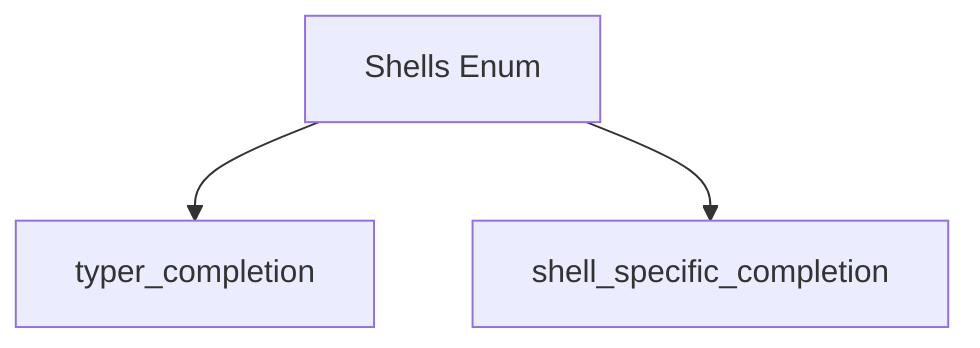

# `shell_utilities` Module Documentation

## Introduction

The `shell_utilities` module provides essential utilities related to shell environments within the Typer framework. Its primary function is to enumerate and manage supported shell types, making it a foundational component for features like shell-specific completion.

## Core Functionality

### `Shells` Component

The `Shells` component is an enumeration (or similar structure) that defines the various shell types supported by Typer. This component acts as a centralized reference for identifying and differentiating between shells such as Zsh, PowerShell, Fish, and Bash. It is crucial for features that need to adapt their behavior based on the specific shell being used, particularly for generating shell completion scripts.

While the specific implementation details of `Shells` are not provided, its role is to offer a consistent and verifiable set of shell identifiers that other modules can import and utilize.

## Architecture and Component Relationships

The `shell_utilities` module, through its `Shells` component, serves as a fundamental dependency for modules that require knowledge of different shell environments. It provides the canonical definitions for shell types, which are then consumed by modules responsible for generating shell-specific logic, such as completion scripts.

<!-- DIAGRAM_JSON
{
    "direction": "TD",
    "nodes": [
        {"id": "shells_enum", "label": "Shells Enum", "type": "component", "link": null},
        {"id": "typer_completion", "label": "typer_completion", "type": "external", "link": "typer_completion.md"},
        {"id": "shell_specific_completion", "label": "shell_specific_completion", "type": "external", "link": "shell_specific_completion.md"}
    ],
    "edges": [
        {"source": "shells_enum", "target": "typer_completion"},
        {"source": "shells_enum", "target": "shell_specific_completion"}
    ],
    "groups": []
}
-->

## How the Module Fits into the Overall System

The `shell_utilities` module, primarily via its `Shells` component, is an integral part of Typer's completion system. It provides the basic building blocks for identifying target shell environments. Other modules, such as [`typer_completion`](typer_completion.md) and its sub-modules like [`shell_specific_completion`](shell_specific_completion.md), rely on `Shells` to: 

*   Determine the current shell type.
*   Generate appropriate completion scripts or logic for that specific shell.
*   Validate shell types when configuring completion features.

By centralizing the definition of shell types, `shell_utilities` ensures consistency and simplifies the development of shell-aware features across the entire Typer ecosystem. It acts as a shared constant, preventing duplication and potential discrepancies in how different parts of the system refer to shell environments.