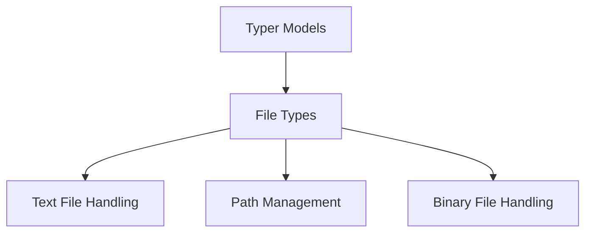

# Text File Handling Module

## Introduction and Purpose

The `text_file_handling` module is a specialized component within the `typer_models.file_types` sub-module, designed to manage the reading and writing of text-based files. It provides core abstractions for representing text files and facilitating operations such as writing string data to them. This module ensures consistent and efficient handling of textual content within the Typer framework.

## Architecture Overview

The `text_file_handling` module is a crucial part of the `file_types` sub-module, which itself resides within the broader `typer_models` module. It works alongside `path_management` and `binary_file_handling` to offer a comprehensive set of file interaction capabilities.

<!-- DIAGRAM_JSON
{
    "direction": "TD",
    "nodes": [
        {"id": "typer_models", "label": "Typer Models", "type": "module", "link": "typer_models.md"},
        {"id": "file_types", "label": "File Types", "type": "module", "link": "file_types.md"},
        {"id": "text_file_handling", "label": "Text File Handling", "type": "module", "link": "text_file_handling.md"},
        {"id": "path_management", "label": "Path Management", "type": "module", "link": "path_management.md"},
        {"id": "binary_file_handling", "label": "Binary File Handling", "type": "module", "link": "binary_file_handling.md"}
    ],
    "edges": [
        {"source": "typer_models", "target": "file_types"},
        {"source": "file_types", "target": "text_file_handling"},
        {"source": "file_types", "target": "path_management"},
        {"source": "file_types", "target": "binary_file_handling"}
    ],
    "groups": []
}
-->

## Core Functionality

This module primarily provides two core components:

### `FileText`
Represents a text file object, encapsulating properties and methods for handling textual content. It serves as a base for specific text file operations.

### `FileTextWrite`
Extends `FileText` to specifically handle writing operations to text files. This component provides the necessary functionalities to write string data to a specified text file path, ensuring proper encoding and file handling.
