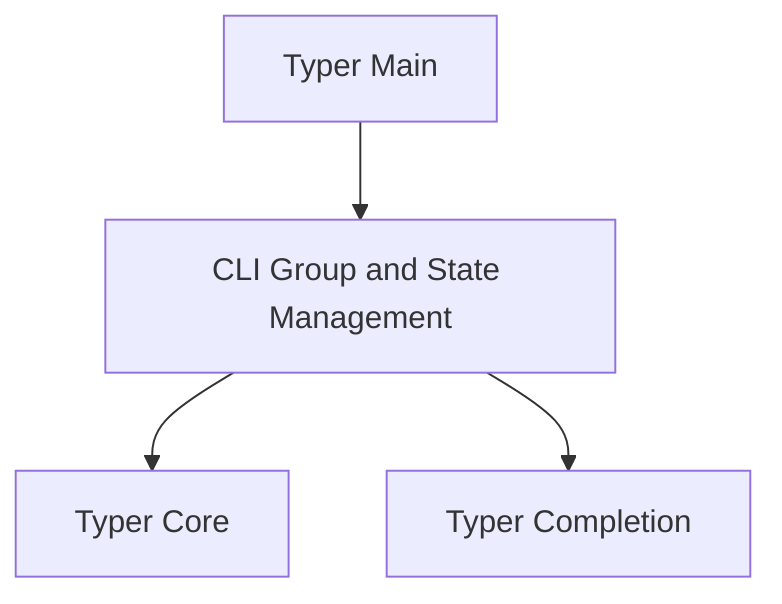

# Typer CLI Module Documentation

## Introduction

The `typer_cli` module serves as a crucial component within the Typer framework, focusing on the core command-line interface (CLI) group functionality and state management. It provides the foundational elements for defining and organizing CLI commands, enabling a structured approach to building robust and interactive command-line applications. This module works in conjunction with other Typer modules, such as `typer_core` for command and argument handling, `typer_main` for application entry points, and `typer_completion` for shell auto-completion.

## Architecture Overview

The `typer_cli` module is designed to integrate seamlessly with the broader Typer ecosystem. It defines the `TyperCLIGroup` class, which acts as a central container for CLI commands and sub-commands, allowing for hierarchical organization. The `State` component facilitates the management of application-specific data and configurations throughout the CLI's lifecycle. This module depends on `typer_core` for defining the underlying `TyperCommand` and `TyperGroup` structures, and is utilized by `typer_main` to instantiate and run the CLI application. The relationships are illustrated in the diagram below.

<!-- DIAGRAM_JSON
{
    "direction": "TD",
    "nodes": [
        {"id": "cli_group_state", "label": "CLI Group and State Management", "type": "module", "link": "cli_group_state.md"},
        {"id": "typer_core", "label": "Typer Core", "type": "module", "link": "typer_core.md"},
        {"id": "typer_main", "label": "Typer Main", "type": "module", "link": "typer_main.md"},
        {"id": "typer_completion", "label": "Typer Completion", "type": "module", "link": "typer_completion.md"}
    ],
    "edges": [
        {"source": "cli_group_state", "target": "typer_core"},
        {"source": "typer_main", "target": "cli_group_state"},
        {"source": "cli_group_state", "target": "typer_completion"}
    ],
    "groups": []
}
-->

## Sub-modules

### CLI Group and State Management

The `cli_group_state` sub-module encapsulates the core logic for defining CLI command groups and managing application state. It includes the `TyperCLIGroup` and `State` components, which are essential for organizing commands hierarchically and maintaining data across different command executions. For detailed information, refer to the [CLI Group and State Management documentation](cli_group_state.md).
