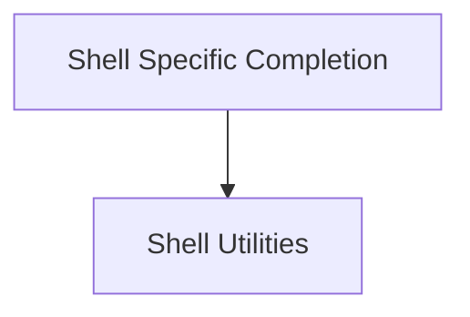

# Typer Completion Module

The `typer_completion` module is responsible for generating shell completion scripts for various shells, enhancing the user experience by providing command and argument suggestions. It integrates with `Typer` applications to offer intelligent auto-completion capabilities.

## Architecture Overview

The `typer_completion` module is structured into the following sub-modules, each handling a specific aspect of shell completion generation and utility.

<!-- DIAGRAM_JSON
{
    "direction": "TD",
    "nodes": [
        {"id": "shell_specific_completion", "label": "Shell Specific Completion", "type": "module", "link": "shell_specific_completion.md"},
        {"id": "shell_utilities", "label": "Shell Utilities", "type": "module", "link": "shell_utilities.md"}
    ],
    "edges": [
        {"source": "shell_specific_completion", "target": "shell_utilities"}
    ],
    "groups": []
}
-->

## Sub-modules

### [Shell Specific Completion](shell_specific_completion.md)
This sub-module provides classes for generating completion scripts tailored to popular shells like Zsh, PowerShell, Fish, and Bash. It encapsulates the logic for creating shell-specific completion outputs based on the `Typer` application's defined commands and arguments.

### [Shell Utilities](shell_utilities.md)
This sub-module contains utility functions and classes related to shell operations and detection. It provides foundational elements used by the shell-specific completion generators, such as identifying the current shell environment.
