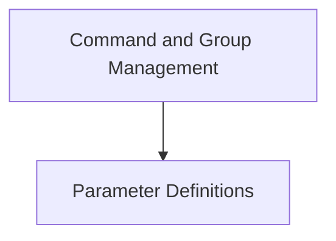

# Typer Core Module Documentation

## Introduction
The `typer_core` module is the foundational layer of the Typer framework, providing the essential building blocks for defining command-line applications. It encapsulates the core concepts of arguments, options, commands, and command groups, enabling developers to construct robust and intuitive CLIs. This module is central to how Typer parses user input and dispatches to the correct functions.

## Architecture Overview
The `typer_core` module is structured into two main sub-modules: `command_management` and `parameter_definitions`. The `command_management` sub-module is responsible for organizing and executing commands and their groups, while the `parameter_definitions` sub-module focuses on how arguments and options are defined and handled. These sub-modules work in concert to interpret the structure and expected inputs of a Typer application.

<!-- DIAGRAM_JSON
{
    "direction": "TD",
    "nodes": [
        {"id": "command_management", "label": "Command and Group Management", "type": "module", "link": "command_management.md"},
        {"id": "parameter_definitions", "label": "Parameter Definitions", "type": "module", "link": "parameter_definitions.md"}
    ],
    "edges": [
        {"source": "command_management", "target": "parameter_definitions"}
    ],
    "groups": []
}
-->

## Sub-modules

### Command and Group Management
The `command_management` sub-module defines `TyperGroup` and `TyperCommand`, which are crucial for structuring a Typer application. `TyperGroup` allows for hierarchical organization of commands, enabling complex CLIs with nested sub-commands. `TyperCommand` represents individual callable actions within the CLI.
[Learn more about Command and Group Management](command_management.md)

### Parameter Definitions
The `parameter_definitions` sub-module provides `TyperArgument` and `TyperOption`, which are used to declare the expected inputs for commands. `TyperArgument` represents positional arguments, while `TyperOption` defines optional flags or parameters that can be passed to a command. These classes are fundamental for defining the interface of your CLI commands.
[Learn more about Parameter Definitions](parameter_definitions.md)